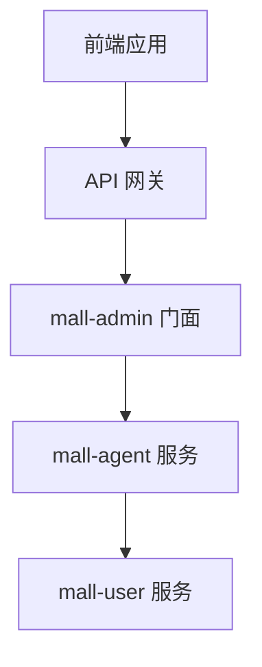

# 架构规范标题

## 概述

描述本架构规范的背景、目标和适用范围。

## 架构设计

### 1. 分层架构

```
┌─────────────────────────────────────┐
│           接口层 (Controller)         │
├─────────────────────────────────────┤
│           应用层 (Service)            │
├─────────────────────────────────────┤
│           领域层 (Domain)             │
├─────────────────────────────────────┤
│         基础设施层 (Mapper)           │
└─────────────────────────────────────┘
```

### 2. 服务职责

| 层级 | 服务类型 | 命名规范 | 职责 | 调用规则 |
|------|----------|----------|------|----------|
| Controller | 控制器 | `XxxController` | 接收请求，参数校验 | 只能调用 XxxDomainService |
| Domain | 业务域服务 | `XxxDomainService` | 业务编排 | 可调用 Query/Manage Service |
| Query | 查询服务 | `XxxQueryService` | 只读查询 | 只能调用 AimXxxService |
| Manage | 管理服务 | `XxxManageService` | 增删改操作 | 只能调用 AimXxxService |
| Data | 数据服务 | `AimXxxService` | 封装数据访问 | 可调用 AimXxxMapper |

## 调用关系

### 服务调用规则

| 调用方 | 可调用 | 禁止调用 |
|--------|--------|----------|
| 门面服务 | 应用服务、支撑服务 | - |
| 应用服务 | 支撑服务 | 门面服务 |
| 支撑服务 | - | 门面服务、应用服务 |

### 调用关系图



## 模块规范

### 模块类型

| 模块类型 | 路径前缀 | 说明 |
|----------|----------|------|
| 门面模块-管理端 | `/admin/api/v1/` | 供管理后台调用 |
| 门面模块-客户端 | `/app/api/v1/` | 供 APP/商家端调用 |
| 服务模块 | `/inner/api/v1/` | 供其他服务 RPC 调用 |

## 适用范围

- 所有新建微服务模块
- 所有服务间调用设计

## 相关规范

- [编码规范](./编码规范.md)
- [接口规范](./接口规范.md)

## 版本历史

| 版本 | 日期 | 修改人 | 修改内容 |
|------|------|--------|----------|
| v1.0 | YYYY-MM-DD | 作者名 | 初始版本 |

## 附件

- 规范维护责任人：架构组
- 审核周期：每季度
