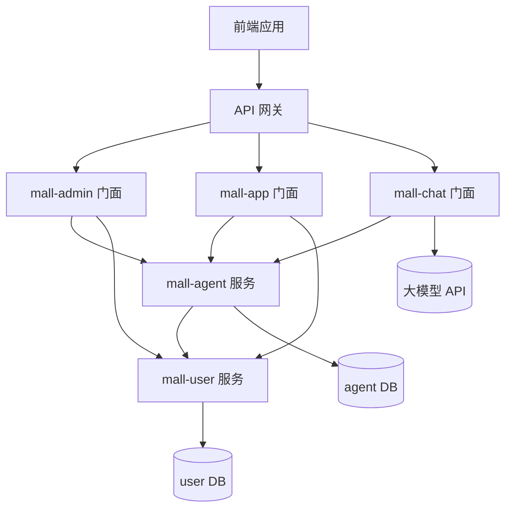
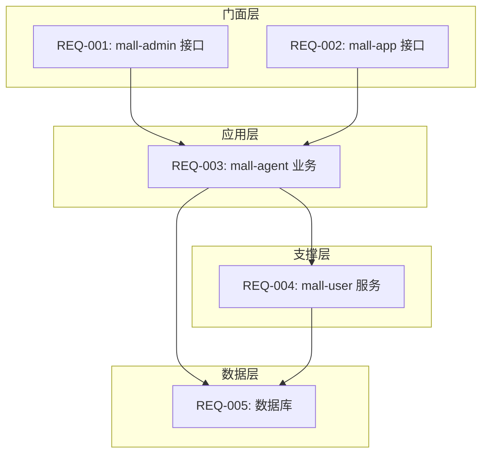
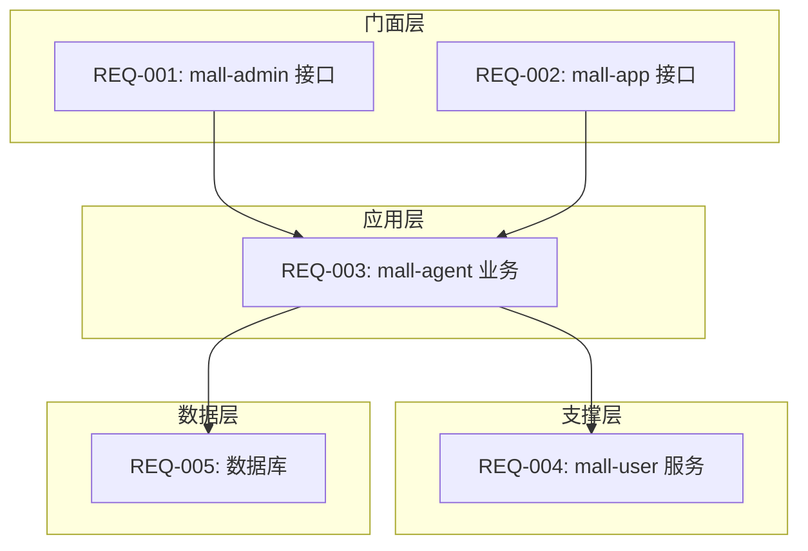

## 拆分原则

### 1. 功能维度拆分

```
PRD 功能模块
├── 用户故事 1
│   ├── 子需求 1.1 [mall-admin] 管理后台接口
│   ├── 子需求 1.2 [mall-app] APP 端接口
│   ├── 子需求 1.3 [mall-agent] 智能员工业务逻辑
│   ├── 子需求 1.4 [mall-user] 用户数据操作
│   └── 子需求 1.5 [DB] 数据库表设计
├── 用户故事 2
│   └── ...
```

### 2. 服务归属判断规则

**本规则只关注后端服务，不涉及前端/基础设施**

| 归属           | 判断标准           | 输出标记           | 代码路径                                     |
|--------------|----------------|----------------|------------------------------------------|
| **门面服务-管理端** | 供管理后台调用的接口     | `[mall-admin]` | `mall-admin/.../admin/controller/` |
| **门面服务-客户端** | 供 APP/商家端调用的接口 | `[mall-app]`   | `mall-app/.../app/controller/`     |
| **门面服务-AI对话** | AI 对话功能，直接调用大模型 | `[mall-chat]`  | `mall-chat/.../chat/controller/`   |
| **智能员工服务**   | 智能员工核心业务逻辑     | `[mall-agent]` | `mall-agent/.../agent/`            |
| **用户服务**     | 用户相关数据操作       | `[mall-user]`  | `mall-user/.../user/`              |
| **数据库**      | 表结构设计、DDL      | `[DB]`         | `{服务}/src/main/resources/db/`      |
| **跨服务共享**    | DTO、Feign 接口定义 | `[SHARED]`      | 各服务的 `dto/` `feign/` 包                     |

**数据库设计规范参考**：详细的数据库字段类型、字符集、通用字段等规范见 `05-architecture-standards.md` 数据库设计章节

### 3. 架构设计约束

> **详细规范参考**：`.qoder/rules/05-architecture-standards.md`

#### 3.1 服务类型定义

| 术语 | 英文 | 定义 | 调用方 |
|------|------|------|--------|
| **门面服务** | Facade Service | 直接面向前端的服务，接收 HTTP 请求 | 前端应用 |
| **应用服务** | Application Service | 后端内部服务，通过 Feign 供门面服务调用 | 门面服务、其他应用服务 |
| **支撑服务** | Support Service | 提供基础能力的应用服务 | 应用服务 |

#### 3.2 核心约束

**分层调用关系**：
```
前端 → 门面服务（参数校验）→ Feign → 应用服务（业务逻辑）
```

**关键约束**：
- 前端**禁止**直接调用应用服务
- 参数必要性校验在门面层完成
- 应用服务专注业务逻辑，信任门面层已做基础校验

#### 3.3 路径与参数规范（摘要）

| 服务类型 | 路径前缀 | 参数规则 |
|----------|----------|----------|
| **门面服务-管理端** | `/admin/api/v1/` | GET可用多个@RequestParam，POST用@RequestBody，允许一个路径参数 |
| **门面服务-客户端** | `/app/api/v1/` | 同上 |
| **应用服务** | `/inner/api/v1/` | ≤2个基础类型用@RequestParam，否则一律@RequestBody，禁止路径参数 |

**示例**：

```
# 门面层（允许一个路径参数）
GET /admin/api/v1/ai-employee/{employeeId}/detail
POST /app/api/v1/ai-employee/{employeeId}/offline

# 应用层 - Feign（禁止路径参数）
GET /inner/api/v1/ai-employee/detail?employeeId=xxx
POST /inner/api/v1/ai-employee/offline（参数在 body 中）
```

**3.6 技术选型约束**

- **技术栈**：Spring Boot 3.x + MyBatis/MyBatis-Plus
- **异常处理**：仅允许使用三种标准异常类型（MethodArgumentValidationException、RemoteApiCallException、BusinessException）
- **数据库访问**：CRUD 操作规范，禁止使用 QueryWrapper、SELECT *、脚本标签

### 4. 服务调用关系



**调用规则：**

- 门面服务（mall-admin/mall-app/mall-chat）可调用应用服务和支撑服务
- 应用服务（mall-agent）可调用支撑服务（mall-user）
- mall-chat 可直接调用大模型 API
- 禁止跨层级调用（如应用服务直接调用门面服务）
- 所有跨服务调用通过 OpenFeign 实现

### 5. 依赖关系定义

依赖关系直接记录在子需求中，不再单独生成 `dependencies.md` 文件。

**每个子需求需包含以下依赖信息：**

| 依赖项 | 说明 | 示例 |
|--------|------|------|
| **依赖服务** | 需要调用的其他服务 | mall-agent, mall-user |
| **依赖数据库表** | 需要访问的数据库表 | aim_employee, aim_user |
| **被谁依赖** | 哪些子需求依赖本需求 | REQ-001, REQ-002 |

**依赖类型说明：**

- **Hard 依赖**：必须等待被依赖方完成后才能开发
  - Controller → Service
  - Service → Repository
  - Feign Client → Provider Service

- **Soft 依赖**：可以并行开发，但需要协调接口契约
  - 门面服务 → 应用服务（接口定义优先）

---

## 执行流程

### Step 1: 读取 PRD

1. 解析 PRD 文档结构
2. 提取功能模块列表
3. 识别用户故事和验收标准

### Step 2: 逐模块拆分

对每个功能模块，按以下步骤分析：

1. **识别调用入口**
    - 管理后台功能 → 标记 `[mall-admin]`
    - APP/商家端功能 → 标记 `[mall-app]`
    - AI 对话功能 → 标记 `[mall-chat]`

2. **识别业务归属**
    - 智能员工相关逻辑 → 标记 `[mall-agent]`
    - 用户相关操作 → 标记 `[mall-user]`

3. **识别数据存储**
    - 新表/字段设计 → 标记 `[DB]`

4. **识别跨服务调用**
    - Feign 客户端定义 → 标记 `[SHARED]`

### Step 3: 依赖分析

```
分析顺序：
1. 服务调用链（mall-admin/app/chat → mall-agent → mall-user）
2. 内部依赖（Controller → Service → Repository）
3. Feign 接口契约（被调用方优先定义）
4. 数据流向（DB → Service → Controller）
```

### Step 4: 生成拆分文档

**decomposition.md 结构：**

```markdown
# 需求分解结果

## Program: P-YYYY-NNN-{feature-name}

### 需求概述

- **来源**: PRD 文档 / 简要需求描述
- **功能模块**: xxx
- **涉及服务**: mall-admin, mall-app, mall-agent, mall-user

### 子需求列表

#### REQ-001: [mall-admin] 创建智能员工接口

- **来源**: PRD 第 2.1 节
- **描述**: 管理后台创建智能员工
- **代码位置**: `mall-admin/src/main/java/com/aim/mall/admin/controller/AgentAdminController.java`
- **接口路径**: `POST /admin/api/v1/ai-employee`
- **依赖模块**:
  - 依赖服务: mall-agent
  - 依赖数据库表: aim_employee
- **验收标准**:
  - [ ] 接收创建智能员工请求参数
  - [ ] 调用 mall-agent 服务创建智能员工
  - [ ] 返回创建结果

#### REQ-002: [mall-app] 获取智能员工列表接口

- **来源**: PRD 第 2.2 节
- **描述**: APP 端获取智能员工列表
- **代码位置**: `mall-app/src/main/java/com/aim/mall/app/controller/AgentAppController.java`
- **接口路径**: `GET /app/api/v1/ai-employee/list`
- **依赖模块**:
  - 依赖服务: mall-agent
  - 依赖数据库表: aim_employee
- **验收标准**:
  - [ ] 支持分页查询
  - [ ] 调用 mall-agent 服务获取数据
  - [ ] 返回 VO 对象

#### REQ-003: [mall-agent] 智能员工业务逻辑

- **来源**: PRD 第 2.1/2.2 节
- **描述**: 智能员工核心业务逻辑实现
- **代码位置**: `mall-agent/src/main/java/com/aim/mall/agent/service/AgentService.java`
- **Inner 接口路径**:
  - `POST /inner/api/v1/ai-employee/create`
  - `GET /inner/api/v1/ai-employee/list`
- **依赖模块**:
  - 依赖服务: mall-user
  - 依赖数据库表: aim_employee, aim_user
- **验收标准**:
  - [ ] 实现创建智能员工逻辑
  - [ ] 实现查询智能员工逻辑
  - [ ] 调用 mall-user 服务查询用户信息
  - [ ] 返回 Response DTO 对象

#### REQ-004: [mall-user] 用户信息查询

- **来源**: PRD 第 2.1/2.2 节
- **描述**: 提供用户信息查询接口供 mall-agent 调用
- **代码位置**: `mall-user/src/main/java/com/aim/mall/user/feign/UserFeignService.java`
- **Inner 接口路径**: `GET /inner/api/v1/user/detail?userId={userId}`
- **依赖模块**:
  - 依赖服务: 无
  - 依赖数据库表: aim_user
- **验收标准**:
  - [ ] 定义 Feign 接口（使用 Query 参数，禁止路径参数）
  - [ ] 实现用户查询逻辑
  - [ ] 返回 Response DTO 对象

#### REQ-005: [DB] 智能员工表设计

- **来源**: PRD 第 2.1 节
- **描述**: 设计智能员工数据表
- **代码位置**: `mall-agent/src/main/resources/db/V001__create_agent.sql`
- **涉及表**: aim_employee
- **依赖模块**:
  - 被依赖: REQ-003, REQ-004
- **验收标准**:
  - [ ] 表结构设计
  - [ ] 索引设计
  - [ ] 字段注释

### 数据库设计汇总

#### 表清单

| 序号 | 表名 | 所属服务 | 用途 | 关联子需求 |
|------|------|----------|------|------------|
| 1 | aim_employee | mall-agent | 智能员工表 | REQ-003, REQ-005 |
| 2 | aim_user | mall-user | 用户表 | REQ-004, REQ-005 |

#### 表结构详情

**aim_employee**

```sql
CREATE TABLE aim_employee (
    id BIGINT PRIMARY KEY AUTO_INCREMENT COMMENT '主键ID',
    name VARCHAR(100) NOT NULL COMMENT '员工名称',
    -- 其他字段
    create_time DATETIME DEFAULT CURRENT_TIMESTAMP COMMENT '创建时间',
    update_time DATETIME DEFAULT CURRENT_TIMESTAMP ON UPDATE CURRENT_TIMESTAMP COMMENT '更新时间',
    deleted TINYINT DEFAULT 0 COMMENT '删除标记'
) COMMENT='智能员工表';
```

### 依赖关系图



### 依赖矩阵

| 子需求 | 依赖服务 | 依赖数据库表 | 被谁依赖 |
|--------|----------|--------------|----------|
| REQ-001 | mall-agent | aim_employee | - |
| REQ-002 | mall-agent | aim_employee | - |
| REQ-003 | mall-user | aim_employee, aim_user | REQ-001, REQ-002 |
| REQ-004 | - | aim_user | REQ-003 |
| REQ-005 | - | - | REQ-003, REQ-004 |

### 开发顺序建议

1. **第一阶段**: REQ-005（数据库表设计）
2. **第二阶段**: REQ-004（mall-user 服务）
3. **第三阶段**: REQ-003（mall-agent 业务）
4. **第四阶段**: REQ-001, REQ-002（门面接口）
```

---

## 依赖图生成

使用 Mermaid 生成依赖关系图：



---

## 检查清单

- [ ] 所有 PRD 功能点都已覆盖
- [ ] 每个子需求都有明确的服务归属（mall-admin/mall-app/mall-chat/mall-agent/mall-user）
- [ ] 接口入口正确区分（管理端 vs 客户端）
- [ ] Feign 调用关系已识别
- [ ] 每个子需求的依赖模块已标注（依赖服务、依赖数据库表）
- [ ] 数据库表设计已汇总到文档末尾
- [ ] 代码路径符合项目结构规范
- [ ] 分层接口风格规范已明确（门面层 RESTful / 应用层简化）
- [ ] 参数校验职责已明确（门面层负责）
- [ ] 不涉及前端/基础设施（Redis/网关/鉴权等）
