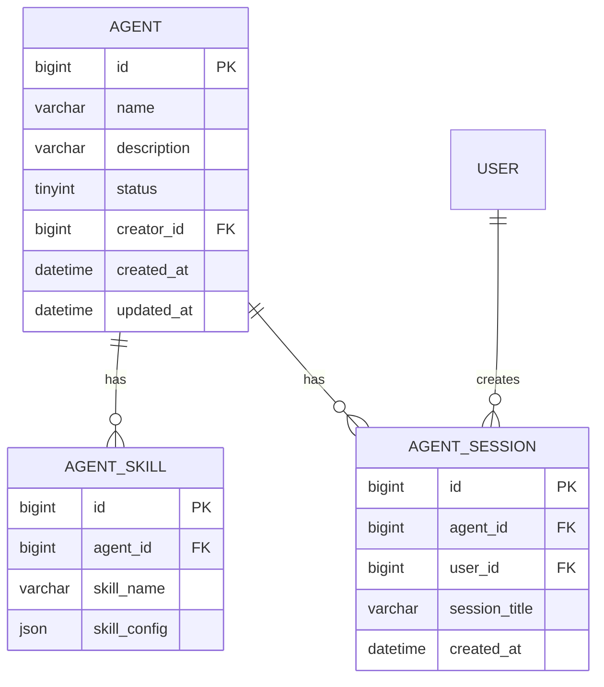
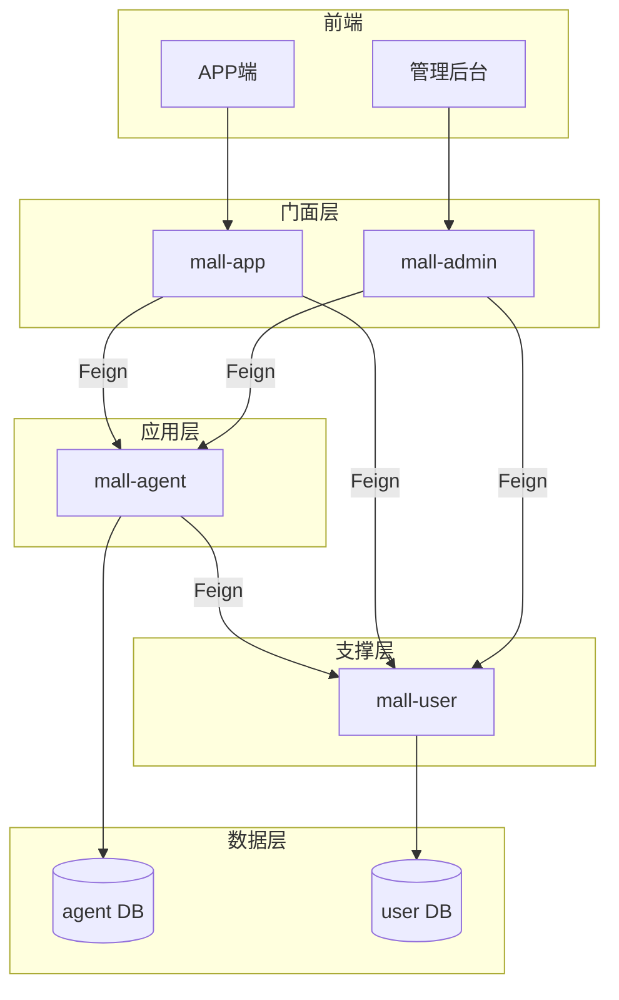
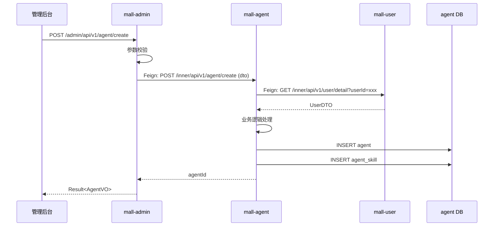
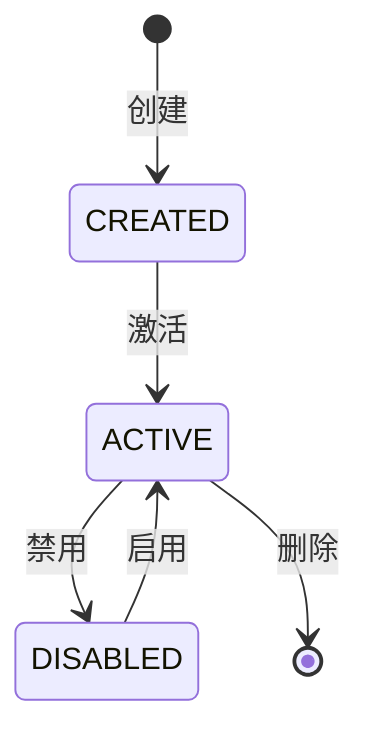

## 1. 概述

### 1.1 目标

基于确认后的需求和架构规范，生成详细的技术规格书，指导后续代码实现。支持迭代修正，当设计不满足要求时，可接受用户补充上下文或修改意见，并智能判断是否需要同步更新需求文档。

### 1.2 输入

- `orchestrator/PROGRAMS/{decomposition_program_id}/workspace/decomposition.md` — 需求拆分结果
- `orchestrator/PROGRAMS/{program_id}/workspace/answers.md` — 澄清确认结果
- `orchestrator/PROGRAMS/{program_id}/workspace/decisions.md` — 技术决策记录
- `.qoder/rules/05-architecture-standards.md` — 架构规范
- 用户补充的上下文（现有表结构、接口文档等）

### 1.3 输出

- `orchestrator/PROGRAMS/{program_id}/workspace/tech-spec.md` — 主技术规格书
- `orchestrator/PROGRAMS/{program_id}/workspace/openapi.yaml` — OpenAPI 定义
- `orchestrator/PROGRAMS/{program_id}/workspace/checklist.md` — 验收标准
- （可选）更新的需求文档（decomposition.md, answers.md, decisions.md）

---

## 2. 数据模型设计

### 2.1 ER 图

使用 Mermaid 语法绘制实体关系图：



### 2.2 表结构定义

参考 `05-architecture-standards.md` 中的数据库设计规范定义表结构。

示例：

```sql
CREATE TABLE agent
(
    id          BIGINT PRIMARY KEY AUTO_INCREMENT,
    name        VARCHAR(100) NOT NULL COMMENT '智能员工名称',
    description VARCHAR(500) COMMENT '描述',
    status      TINYINT  DEFAULT 1 COMMENT '状态：0-禁用 1-启用',
    creator_id  BIGINT COMMENT '创建者用户ID',
    created_at  DATETIME DEFAULT CURRENT_TIMESTAMP,
    updated_at  DATETIME DEFAULT CURRENT_TIMESTAMP ON UPDATE CURRENT_TIMESTAMP,
    INDEX idx_creator_id (creator_id),
    INDEX idx_status (status)
) COMMENT '智能员工表';
```

---

## 3. API 接口定义

### 3.1 接口概览

| 服务端点                                      | 方法   | 描述         | 调用方    |
|-------------------------------------------|------|------------|--------|
| mall-admin: /admin/api/v1/agent/create          | POST | 创建智能员工     | 管理后台   |
| mall-admin: /admin/api/v1/agent/list            | GET  | 查询智能员工列表   | 管理后台 |
| mall-admin: /admin/api/v1/agent/{id}/detail     | GET  | 获取智能员工详情（一个路径参数） | 管理后台 |
| mall-app: /app/api/v1/agent/available      | GET  | 获取可用智能员工   | APP端   |
| mall-app: /app/api/v1/agent/session/create | POST | 创建会话       | APP端   |
| mall-agent: /inner/api/v1/agent/detail    | GET  | 内部获取智能员工详情（Query参数） | 门面服务   |
| mall-agent: /inner/api/v1/agent/list    | GET  | 内部查询智能员工列表（Query参数） | 门面服务   |
| mall-agent: /inner/api/v1/agent/create    | POST  | 内部创建智能员工（RequestBody） | 门面服务   |
| mall-user: /inner/api/v1/user/detail      | GET  | 内部获取用户信息（Query参数）   | 应用服务   |

### 3.2 OpenAPI 定义

完整 OpenAPI 3.0 定义见: `orchestrator/PROGRAMS/{program_id}/workspace/openapi.yaml`

关键接口示例：

```yaml
# mall-admin Controller
paths:
  /api/v1/agent/create:
    post:
      summary: 创建智能员工
      tags:
        - AgentAdmin
      requestBody:
        required: true
        content:
          application/json:
            schema:
              type: object
              required:
                - name
              properties:
                name:
                  type: string
                  maxLength: 100
                description:
                  type: string
                  maxLength: 500
                skills:
                  type: array
                  items:
                    type: object
                    properties:
                      skillName:
                        type: string
                      skillConfig:
                        type: object
      responses:
        '200':
          description: 创建成功
          content:
            application/json:
              schema:
                $ref: '#/components/schemas/ResultAgentVO'
```

### 3.3 Feign 接口定义

```java
// mall-agent 服务提供，供门面服务调用
@FeignClient(name = "mall-agent", path = "/inner/api/v1")
public interface AgentFeignService {

    // 查询类：使用 Query 参数，禁止路径参数
    @GetMapping("/agent/detail")
    Result<AgentApiResponse> getAgentById(@RequestParam("agentId") Long agentId);

    @PostMapping("/agent/list")
    Result<PageResult<AgentApiResponse>> pageAgent(@RequestBody AgentListApiRequest request);

    // 操作类：使用 RequestBody
    @PostMapping("/agent/create")
    Result<Long> createAgent(@RequestBody AgentCreateApiRequest request);

    @PostMapping("/agent/update-status")
    Result<Void> updateAgentStatus(@RequestBody AgentStatusApiRequest request);
}

// mall-user 服务提供，供 mall-agent 调用
@FeignClient(name = "mall-user", path = "/inner/api/v1")
public interface UserFeignService {

    // 查询类：使用 Query 参数
    @GetMapping("/user/detail")
    Result<UserDTO> getUserById(@RequestParam("userId") Long userId);

    @GetMapping("/user/quota")
    Result<UserQuotaDTO> getUserQuota(@RequestParam("userId") Long userId);
}
```

### 3.4 错误码规范

> **参考文档**: `.qoder/repowiki/zh/docs/specs/错误码规范.md`

错误码采用 **8位数字字符串** 格式：`SSMMTNNN`

- **SS**: 系统标识 (System Identifier) - 电商主系统为 `10`
- **MM**: 模块标识 (Module Identifier) - 智能员工模块为 `09`
- **T**: 错误类型 (Error Type)
- **NNN**: 错误序号 (Error Number)

#### 错误类型定义

| 类型值 | 类型名称 | 说明 |
|--------|----------|------|
| 1 | 参数错误 | 输入参数校验失败 |
| 2 | 业务错误 | 业务规则校验失败 |
| 3 | 远程调用错误 | Feign 调用失败 |
| 4 | 数据库错误 | 数据库操作异常 |
| 5 | 系统错误 | 系统内部错误 |

#### 错误序号分段（按类型）

| 范围 | 用途 |
|------|------|
| 001-099 | 基础参数校验错误 |
| 100-199 | 业务规则验证错误 |
| 200-299 | 业务状态验证错误 |
| 300-399 | 远程服务调用错误 |
| 400-499 | 数据库操作错误 |
| 500-599 | 系统级错误 |

#### 示例错误码

| 错误码 | 描述 | HTTP 状态 | 使用场景 |
|--------|------|-----------|----------|
| 10091001 | 参数错误 | 400 | 通用参数校验失败 |
| 10092001 | 业务错误 | 400 | 通用业务规则错误 |
| 10092002 | 资源不存在 | 404 | 查询的资源不存在 |
| 10095001 | 系统错误 | 500 | 系统内部异常 |

#### 错误消息规范

- 所有含动态内容的错误消息必须使用 `{0}, {1}, {2}...` 占位符
- 示例：`商品 {0} 库存不足，当前库存 {1}`

---

## 4. 架构设计

### 4.1 服务调用关系



### 4.2 时序图（创建智能员工）



### 4.3 代码结构

```
mall-admin/src/main/java/com/aim/mall/admin/
├── controller/
│   └── AgentAdminController.java      # 管理后台接口
├── feign/
│   └── AgentFeignService.java          # 调用 mall-agent
└── vo/
    └── AgentVO.java                   # 返回视图对象

mall-app/src/main/java/com/aim/mall/app/
├── controller/
│   └── AgentAppController.java     # 客户端接口
├── feign/
│   └── AgentFeignService.java          # 调用 mall-agent
└── vo/
    └── AgentVO.java

mall-agent/src/main/java/com/aim/mall/agent/
├── controller/
│   ├── AgentController.java           # 对外接口
│   └── inner/
│       └── AgentInnerController.java  # 内部 Feign 接口（/inner/api/v1/）
├── service/
│   ├── AgentService.java
│   └── impl/
│       └── AgentServiceImpl.java
├── repository/
│   ├── AgentRepository.java
│   └── AgentSkillRepository.java
├── entity/
│   ├── Agent.java
│   └── AgentSkill.java
├── dto/
│   ├── AgentDTO.java
│   └── AgentCreateDTO.java
├── feign/
│   └── UserFeignService.java           # 调用 mall-user
└── config/
    └── FeignConfig.java

mall-user/src/main/java/com/aim/mall/user/
├── controller/
│   └── inner/
│       └── UserInnerController.java  # 内部 Feign 接口（/inner/api/v1/）
├── service/
│   └── UserService.java
├── repository/
│   └── UserRepository.java
├── entity/
│   └── User.java
└── dto/
    └── UserDTO.java
```

---

## 5. 业务规则实现

### 5.1 状态机设计

使用 Mermaid 状态图描述业务状态流转：



### 5.2 校验规则

| 规则名 | 校验内容 | 触发时机 | 实现位置 |
|--------|----------|----------|----------|
| 名称唯一性 | 同一租户下名称唯一 | 创建/更新时 | AgentValidator |
| 技能非空 | 至少绑定一个技能 | 创建时 | AgentService |

### 5.3 业务逻辑流程

关键业务流程的详细实现说明：

```markdown
#### 创建智能员工流程

1. **参数校验**（Controller 层）
   - 校验名称格式（长度、特殊字符）
   - 校验技能列表非空

2. **业务校验**（Service 层）
   - 校验名称唯一性（查询数据库）
   - 校验用户权限（调用 mall-user）

3. **数据持久化**
   - 插入 agent 表
   - 插入 agent_skill 关联表

4. **后置处理**
   - 记录操作日志
   - 发送创建事件（如有）
```

---

## 6. 验收标准

见 `orchestrator/PROGRAMS/{program_id}/workspace/checklist.md`

---

## 7. 附录

### 7.1 相关文档

- PRD: {PRD路径}
- 需求拆分: `orchestrator/PROGRAMS/{decomposition_program_id}/workspace/decomposition.md`
- 技术决策: `orchestrator/PROGRAMS/{program_id}/workspace/decisions.md`
- 架构规范: .qoder/rules/05-architecture-standards.md
- 编码规范: .qoder/rules/04-coding-standards.md

### 7.2 需求追溯矩阵

| 子需求 | 设计章节 | 数据库表 | API 接口 | 实现类 |
|--------|----------|----------|----------|--------|
| REQ-001 | 3.1, 4.2 | aim_employee | POST /admin/api/v1/agent | AgentAdminController |
| REQ-003 | 3.3, 4.2 | aim_employee | POST /inner/api/v1/agent | AgentService |
| REQ-005 | 2.2 | aim_employee, aim_skill | - | - |

### 7.3 变更影响分析

当技术规格发生变更时，使用以下矩阵判断是否需同步更新需求文档：

| 变更类型 | 影响范围 | 是否需更新需求文档 | 更新目标 |
|----------|----------|-------------------|----------|
| 数据库表名/字段变更 | 数据模型 | 是 | decomposition.md |
| 接口路径/方法变更 | API 设计 | 是 | decomposition.md |
| 接口字段增减 | API 设计 | 判断 | answers.md（如影响业务规则） |
| 依赖服务变更 | 架构设计 | 是 | decomposition.md |
| 状态机变更 | 业务逻辑 | 是 | answers.md, decisions.md |
| 校验规则变更 | 业务逻辑 | 是 | answers.md |
| 代码分层调整 | 实现细节 | 否 | - |
| 缓存/日志策略 | 技术实现 | 否 | - |

### 7.4 变更记录

| 日期   | 版本   | 变更内容 | 作者    | 关联需求变更 |
|------|------|------|-------|------------|
| {日期} | v1.0 | 初始版本 | Agent | - |
| {日期} | v1.1 | 修改表结构 | Agent | REQ-005 字段变更 |
