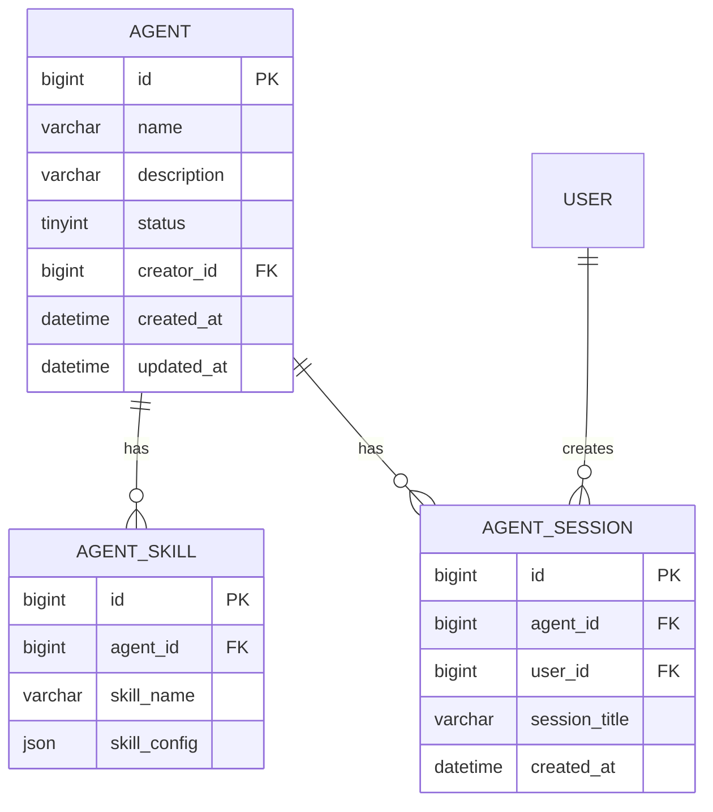
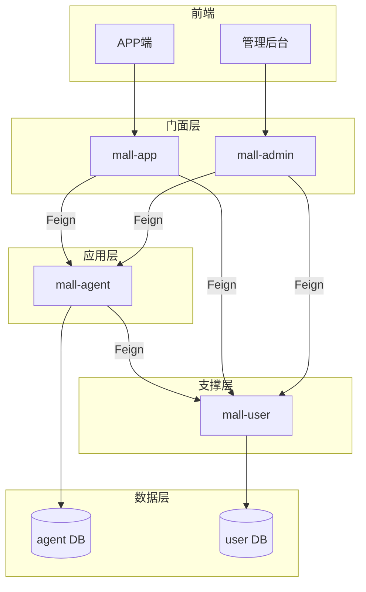
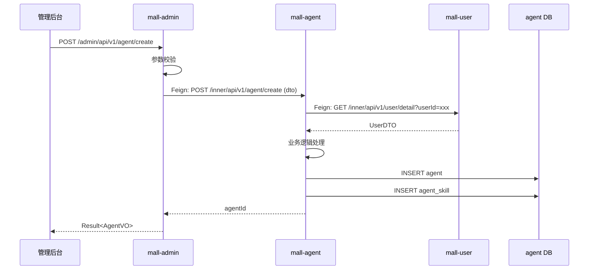

## 1. 概述

### 1.1 目标

基于确认后的需求和架构规范，生成详细的技术规格书，指导后续代码实现。

### 1.2 输入

- `artifacts/spec/{program_id}/requirements/decomposition.md` — 需求拆分结果
- `artifacts/spec/{program_id}/clarification/answers.md` — 澄清确认结果
- `artifacts/spec/{program_id}/clarification/decisions.md` — 技术决策记录
- `.qoder/rules/05-architecture-standards.md` — 架构规范

### 1.3 输出

- `artifacts/spec/{program_id}/design.md` — 主技术规格书
- `artifacts/spec/{program_id}/api/openapi.yaml` — OpenAPI 定义
- `artifacts/spec/{program_id}/diagrams/` — 架构图、ER 图
- `artifacts/spec/{program_id}/checklist.md` — 验收标准

---

## 2. 数据模型设计

### 2.1 ER 图

使用 Mermaid 语法绘制实体关系图：



### 2.2 表结构定义

参考 `05-architecture-standards.md` 中的数据库设计规范定义表结构。

示例：

```sql
CREATE TABLE agent
(
    id          BIGINT PRIMARY KEY AUTO_INCREMENT,
    name        VARCHAR(100) NOT NULL COMMENT '智能员工名称',
    description VARCHAR(500) COMMENT '描述',
    status      TINYINT  DEFAULT 1 COMMENT '状态：0-禁用 1-启用',
    creator_id  BIGINT COMMENT '创建者用户ID',
    created_at  DATETIME DEFAULT CURRENT_TIMESTAMP,
    updated_at  DATETIME DEFAULT CURRENT_TIMESTAMP ON UPDATE CURRENT_TIMESTAMP,
    INDEX idx_creator_id (creator_id),
    INDEX idx_status (status)
) COMMENT '智能员工表';
```

---

## 3. API 接口定义

### 3.1 接口概览

| 服务端点                                      | 方法   | 描述         | 调用方    |
|-------------------------------------------|------|------------|--------|
| mall-admin: /admin/api/v1/agent/create          | POST | 创建智能员工     | 管理后台   |
| mall-admin: /admin/api/v1/agent/list            | GET  | 查询智能员工列表   | 管理后台 |
| mall-admin: /admin/api/v1/agent/{id}/detail     | GET  | 获取智能员工详情（一个路径参数） | 管理后台 |
| mall-app: /app/api/v1/agent/available      | GET  | 获取可用智能员工   | APP端   |
| mall-app: /app/api/v1/agent/session/create | POST | 创建会话       | APP端   |
| mall-agent: /inner/api/v1/agent/detail    | GET  | 内部获取智能员工详情（Query参数） | 门面服务   |
| mall-agent: /inner/api/v1/agent/list    | GET  | 内部查询智能员工列表（Query参数） | 门面服务   |
| mall-agent: /inner/api/v1/agent/create    | POST  | 内部创建智能员工（RequestBody） | 门面服务   |
| mall-user: /inner/api/v1/user/detail      | GET  | 内部获取用户信息（Query参数）   | 应用服务   |

### 3.2 OpenAPI 定义

完整 OpenAPI 3.0 定义见: `artifacts/spec/{program_id}/api/openapi.yaml`

关键接口示例：

```yaml
# mall-admin Controller
paths:
  /api/v1/agent/create:
    post:
      summary: 创建智能员工
      tags:
        - AgentAdmin
      requestBody:
        required: true
        content:
          application/json:
            schema:
              type: object
              required:
                - name
              properties:
                name:
                  type: string
                  maxLength: 100
                description:
                  type: string
                  maxLength: 500
                skills:
                  type: array
                  items:
                    type: object
                    properties:
                      skillName:
                        type: string
                      skillConfig:
                        type: object
      responses:
        '200':
          description: 创建成功
          content:
            application/json:
              schema:
                $ref: '#/components/schemas/ResultAgentVO'
```

### 3.3 Feign 接口定义

```java
// mall-agent 服务提供，供门面服务调用
@FeignClient(name = "mall-agent", path = "/inner/api/v1")
public interface AgentFeignService {

    // 查询类：使用 Query 参数，禁止路径参数
    @GetMapping("/agent/detail")
    Result<AgentDTO> getAgentById(@RequestParam("agentId") Long agentId);

    @GetMapping("/agent/list")
    Result<PageResult<AgentDTO>> listAgents(@RequestParam("userId") Long userId, 
                                             @RequestParam("status") Integer status);

    // 操作类：使用 RequestBody
    @PostMapping("/agent/create")
    Result<Long> createAgent(@RequestBody AgentCreateDTO dto);

    @PostMapping("/agent/update-status")
    Result<Void> updateAgentStatus(@RequestBody AgentStatusUpdateDTO dto);
}

// mall-user 服务提供，供 mall-agent 调用
@FeignClient(name = "mall-user", path = "/inner/api/v1")
public interface UserFeignService {

    // 查询类：使用 Query 参数
    @GetMapping("/user/detail")
    Result<UserDTO> getUserById(@RequestParam("userId") Long userId);

    @GetMapping("/user/quota")
    Result<UserQuotaDTO> getUserQuota(@RequestParam("userId") Long userId);
}
```

### 3.4 错误码规范

| 错误码        | 描述         | HTTP 状态 |
|------------|------------|---------|
| AGENT_001  | 智能员工名称不能为空 | 400     |
| AGENT_002  | 智能员工不存在    | 404     |
| AGENT_003  | 智能员工已禁用    | 403     |
| USER_001   | 用户不存在      | 404     |
| SYSTEM_001 | 系统内部错误     | 500     |

---

## 4. 架构设计

### 4.1 服务调用关系



### 4.2 时序图（创建智能员工）



### 4.3 代码结构

```
repos/mall-admin/src/main/java/com/aim/mall/admin/
├── controller/
│   └── AgentAdminController.java      # 管理后台接口
├── feign/
│   └── AgentFeignService.java          # 调用 mall-agent
└── vo/
    └── AgentVO.java                   # 返回视图对象

repos/mall-app/src/main/java/com/aim/mall/app/
├── controller/
│   └── AgentAppController.java     # 客户端接口
├── feign/
│   └── AgentFeignService.java          # 调用 mall-agent
└── vo/
    └── AgentVO.java

repos/mall-agent/src/main/java/com/aim/mall/agent/
├── controller/
│   ├── AgentController.java           # 对外接口
│   └── inner/
│       └── AgentInnerController.java  # 内部 Feign 接口（/inner/api/v1/）
├── service/
│   ├── AgentService.java
│   └── impl/
│       └── AgentServiceImpl.java
├── repository/
│   ├── AgentRepository.java
│   └── AgentSkillRepository.java
├── entity/
│   ├── Agent.java
│   └── AgentSkill.java
├── dto/
│   ├── AgentDTO.java
│   └── AgentCreateDTO.java
├── feign/
│   └── UserFeignService.java           # 调用 mall-user
└── config/
    └── FeignConfig.java

repos/mall-user/src/main/java/com/aim/mall/user/
├── controller/
│   └── inner/
│       └── UserInnerController.java  # 内部 Feign 接口（/inner/api/v1/）
├── service/
│   └── UserService.java
├── repository/
│   └── UserRepository.java
├── entity/
│   └── User.java
└── dto/
    └── UserDTO.java
```

---

## 5. 验收标准

见 `artifacts/spec/{program_id}/checklist.md`

---

## 6. 附录

### 6.1 相关文档

- PRD: {PRD路径}
- 需求拆分: artifacts/spec/{program_id}/requirements/decomposition.md
- 技术决策: artifacts/spec/{program_id}/clarification/decisions.md
- 架构规范: .qoder/rules/05-architecture-standards.md
- 编码规范: .qoder/rules/04-coding-standards.md

### 6.2 变更记录

| 日期   | 版本   | 变更内容 | 作者    |
|------|------|------|-------|
| {日期} | v1.0 | 初始版本 | Agent |
