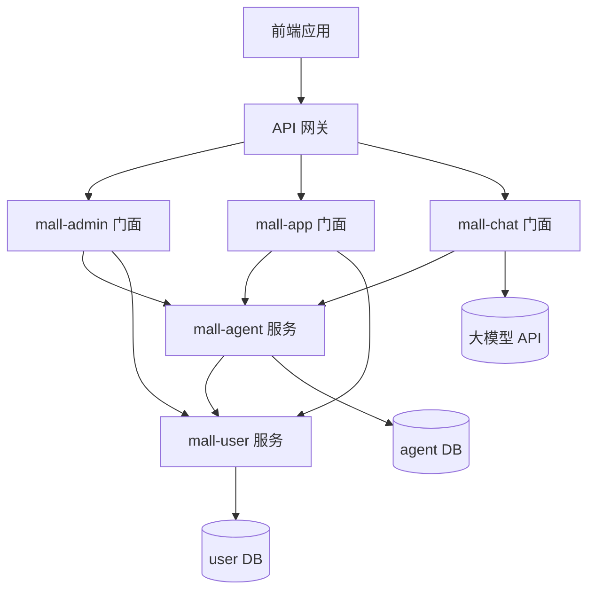

# 架构规范

本规范定义系统架构设计标准，包括分层架构、服务职责、接口风格、数据库设计等。

---

## 1. 分层架构

### 1.1 四层架构强制要求

必须严格遵循：**接口层 → 应用层 → 领域层 → 基础设施层**

```
┌─────────────────────────────────────┐
│           接口层 (Controller)         │  ← 接收请求、参数校验、返回响应
├─────────────────────────────────────┤
│           应用层 (Service)            │  ← 业务流程编排、事务管理
├─────────────────────────────────────┤
│           领域层 (Domain)             │  ← 业务逻辑、领域模型
├─────────────────────────────────────┤
│         基础设施层 (Mapper/Repository) │  ← 数据访问、外部服务调用
└─────────────────────────────────────┘
```

**约束**：
- 禁止跨层直接调用，必须通过接口抽象
- 高层模块不依赖低层模块的具体实现
- 遵循依赖倒置原则

### 1.2 服务职责划分

| 服务类型 | 职责 | 调用范围 |
|----------|------|----------|
| **QueryService** | 只读、无状态、数据聚合与转换 | 仅调用 Mapper 查询 |
| **ManageService** | 写操作流程编排、事务管理、参数校验 | 可调用其他 Service 或 Mapper 进行 CUD |
| **DomainService** | 多实体协作的复杂业务逻辑 | 禁止直接调用 Mapper |

### 1.3 模块类型设计规范

| 模块类型 | 路径前缀 | 说明 |
|----------|----------|------|
| **门面模块-管理端** | `/admin/api/v1/` | 供管理后台调用 |
| **门面模块-客户端** | `/app/api/v1/` | 供 APP/商家端调用 |
| **服务模块** | `/inner/api/v1/` | 供其他服务 RPC 调用 |

---

## 2. 服务架构

### 2.1 服务分层

```
前端应用
    ↓
┌─────────────┐
│  API 网关   │  （基础设施，由运维维护）
└─────────────┘
    ↓
┌─────────────┬─────────────┬─────────────┐
│  mall-admin │   mall-app  │  mall-chat  │  ← 门面服务层
│  (管理后台)  │   (客户端)   │ (AI对话)    │
└─────────────┴─────────────┴─────────────┘
    ↓                    ↓         ↓
    └──────────┬─────────┘         │
               ↓                   │
        ┌─────────────┐            │
        │  mall-agent │  ← 应用服务层（核心业务）
        │ (智能员工)   │            │
        └─────────────┘            │
               ↓                   │
        ┌─────────────┐            │
        │  mall-user  │  ← 支撑服务层
        │  (用户服务)  │            │
        └─────────────┘            │
               ↑                   │
               └───────────────────┘
```

### 2.2 服务调用规则

| 调用方 | 可调用 | 禁止调用 |
|--------|--------|----------|
| 门面服务（mall-admin/mall-app/mall-chat） | 应用服务、支撑服务 | - |
| 应用服务（mall-agent） | 支撑服务 | 门面服务 |
| 支撑服务（mall-user） | - | 门面服务、应用服务 |

**特殊说明**：mall-chat 作为 AI 对话门面服务，可直接调用大模型 API，同时可调用 mall-agent 获取配置信息。

**所有跨服务调用必须通过 OpenFeign 实现。**

### 2.3 服务调用关系图



---

## 3. 接口风格规范

### 3.1 门面服务（mall-admin/mall-app）

- **职责**：对外暴露给前端的接口，负责参数校验和请求转发
- **风格**：完整 RESTful（GET/POST/PUT/DELETE 语义清晰）
- **路径**：
  - 管理端：`/admin/api/v1/{模块名}`
  - 客户端：`/app/api/v1/{模块名}`

**路径参数规范**：
- 允许使用路径参数，但**最多只有一个**
- 路径参数必须放在 URL 最后
- 推荐格式：`/resource/action/{id}`

### 3.2 应用服务（mall-agent/mall-user）

- **职责**：核心业务逻辑处理，供门面服务通过 Feign 调用
- **风格**：简化风格（仅 GET/POST）
  - GET：单参数查询
  - POST：多参数查询、创建、更新、删除（使用 @RequestBody 传递参数）
- **路径**：`/inner/api/v1/{模块名}`

**路径参数规范（Feign 调用）**：
- **禁止在 URL 中使用路径参数**
- 所有参数通过 Query 参数或 RequestBody 传递
- 查询类：使用 Query 参数（GET 请求）
- 操作类：使用 RequestBody（POST 请求）

### 3.3 调用关系

```
前端 → 门面服务（参数校验）→ Feign → 应用服务（业务逻辑）
```

**关键约束**：
- 前端**禁止**直接调用应用服务
- 参数必要性校验在门面层完成
- 应用服务专注业务逻辑，信任门面层已做基础校验

### 3.4 API 路径参数规范对比

| 层级 | 路径参数 | 示例 |
|------|----------|------|
| 门面层 | 允许一个 | `GET /admin/api/v1/agent/{id}` |
| 应用层 | 禁止 | `GET /inner/api/v1/agent/detail?agentId=xxx` |

---

## 4. 数据库设计规范

### 4.1 通用字段规范

所有业务表必须包含以下通用字段：

| 字段名 | 类型 | 约束 | 说明 |
|--------|------|------|------|
| `id` | BIGINT | PRIMARY KEY AUTO_INCREMENT | 主键，自增 |
| `create_time` | DATETIME | DEFAULT CURRENT_TIMESTAMP | 创建时间 |
| `update_time` | DATETIME | DEFAULT CURRENT_TIMESTAMP ON UPDATE CURRENT_TIMESTAMP | 更新时间，自动更新 |
| `is_deleted` | TINYINT | DEFAULT 0 | 逻辑删除标记（0-未删除，1-已删除） |
| `creator_id` | BIGINT | NULLABLE | 创建人ID（可选） |
| `updater_id` | BIGINT | NULLABLE | 更新人ID（可选） |

### 4.2 数据类型选择规范

| 数据类别 | 推荐类型 | 使用场景 |
|----------|----------|----------|
| **布尔值** | TINYINT(1) | 0 表示 false，1 表示 true |
| **小范围整数** | TINYINT | -128~127，如状态码（0-禁用，1-启用） |
| **中等范围整数** | SMALLINT | -32768~32767 |
| **常规整数** | INT | -21亿~21亿 |
| **大整数** | BIGINT | 主键、用户ID、金额计算等 |
| **短字符串** | VARCHAR(n) | 名称、编码等，根据实际长度指定 n |
| **大文本** | TEXT | 描述、JSON 配置、长文本内容 |
| **日期时间** | DATETIME | 无时区要求的日期时间（推荐） |
| **时间戳** | TIMESTAMP | 需要自动时区转换的场景 |

### 4.3 字符集规范

- **默认字符集**：`DEFAULT CHARSET=utf8mb4`
- **排序规则**：**禁止指定具体的 COLLATE**，使用数据库默认排序规则

### 4.4 建表示例

```sql
CREATE TABLE agent
(
    id          BIGINT PRIMARY KEY AUTO_INCREMENT COMMENT '主键ID',
    -- 业务字段
    name        VARCHAR(100) NOT NULL COMMENT '智能员工名称',
    status      TINYINT      DEFAULT 1 COMMENT '状态：0-禁用 1-启用',
    config      JSON COMMENT '配置信息',
    -- 通用字段
    create_time DATETIME     DEFAULT CURRENT_TIMESTAMP COMMENT '创建时间',
    update_time DATETIME     DEFAULT CURRENT_TIMESTAMP ON UPDATE CURRENT_TIMESTAMP COMMENT '更新时间',
    is_deleted  TINYINT      DEFAULT 0 COMMENT '逻辑删除标记：0-未删除 1-已删除',
    creator_id  BIGINT COMMENT '创建人ID',
    updater_id  BIGINT COMMENT '更新人ID',
    -- 索引
    INDEX idx_status (status),
    INDEX idx_create_time (create_time)
) COMMENT '智能员工表'
DEFAULT CHARSET=utf8mb4;
```

### 4.5 DO 类命名规范

严格按表名转换为大驼峰 + DO 后缀：

| 表名 | DO 类名 |
|------|---------|
| `agent` | `AgentDO` |
| `agent_skill` | `AgentSkillDO` |
| `aim_product_info` | `AimProductInfoDO` |

---

## 5. Feign 接口规范

### 5.1 Feign 客户端定义规范

- 查询类：使用 Query 参数，**禁止路径参数**
- 操作类：使用 RequestBody

### 5.2 Feign 调用方使用

- 参数校验（门面层负责）
- 转换为 DTO
- 调用应用服务

---

## 6. 代码结构示例

### 6.1 门面服务（mall-admin）

```
repos/mall-admin/src/main/java/com/aim/mall/admin/
├── controller/
│   └── AgentAdminController.java      # 管理后台接口
├── service/
│   ├── AgentAdminService.java
│   └── impl/
│       └── AgentAdminServiceImpl.java
├── feign/
│   └── AgentFeignService.java          # Feign 客户端
└── vo/
    └── AgentVO.java                   # 返回视图对象
```

### 6.2 应用服务（mall-agent）

```
repos/mall-agent/src/main/java/com/aim/mall/agent/
├── controller/
│   ├── AgentController.java           # 对外接口（如有）
│   └── inner/
│       └── AgentInnerController.java  # 内部 Feign 接口
├── service/
│   ├── AgentService.java
│   └── impl/
│       └── AgentServiceImpl.java
├── mapper/
│   └── AgentMapper.java
├── domain/
│   ├── entity/
│   │   └── AgentDO.java
│   ├── enums/
│   │   └── AgentStatusEnum.java
│   ├── vo/
│   │   └── AgentVO.java
│   └── exception/
│       └── AgentDomainException.java
├── api/
│   ├── dto/
│   │   ├── request/
│   │   │   └── AgentCreateRequest.java
│   │   └── response/
│   │       └── AgentResponse.java
│   └── feign/
│       └── UserFeignService.java
└── config/
    └── FeignConfig.java
```

---

## 7. 检查清单

### 架构设计检查

- [ ] 遵循四层架构（接口层→应用层→领域层→基础设施层）
- [ ] 服务职责划分清晰（QueryService/ManageService/DomainService）
- [ ] 模块类型区分正确（门面模块/服务模块）
- [ ] 服务调用关系符合规范

### 接口设计检查

- [ ] 门面服务使用 RESTful 风格（GET/POST/PUT/DELETE）
- [ ] 应用服务使用简化风格（仅 GET/POST）
- [ ] 门面层路径参数最多一个
- [ ] 应用层禁止路径参数（使用 Query 或 RequestBody）

### 数据库设计检查

- [ ] 包含所有通用字段（id、create_time、update_time、is_deleted 等）
- [ ] 数据类型选择符合规范
- [ ] 字符集为 utf8mb4
- [ ] 不指定 COLLATE
- [ ] DO 类命名符合规范（大驼峰+DO 后缀）

### Feign 接口检查

- [ ] 查询类使用 Query 参数
- [ ] 操作类使用 RequestBody
- [ ] 禁止路径参数

---

## 相关文档

- **代码生成模板**：`.qoder/skills/java-code-generation.md`
- **编码规范**：`.qoder/rules/04-coding-standards.md`
