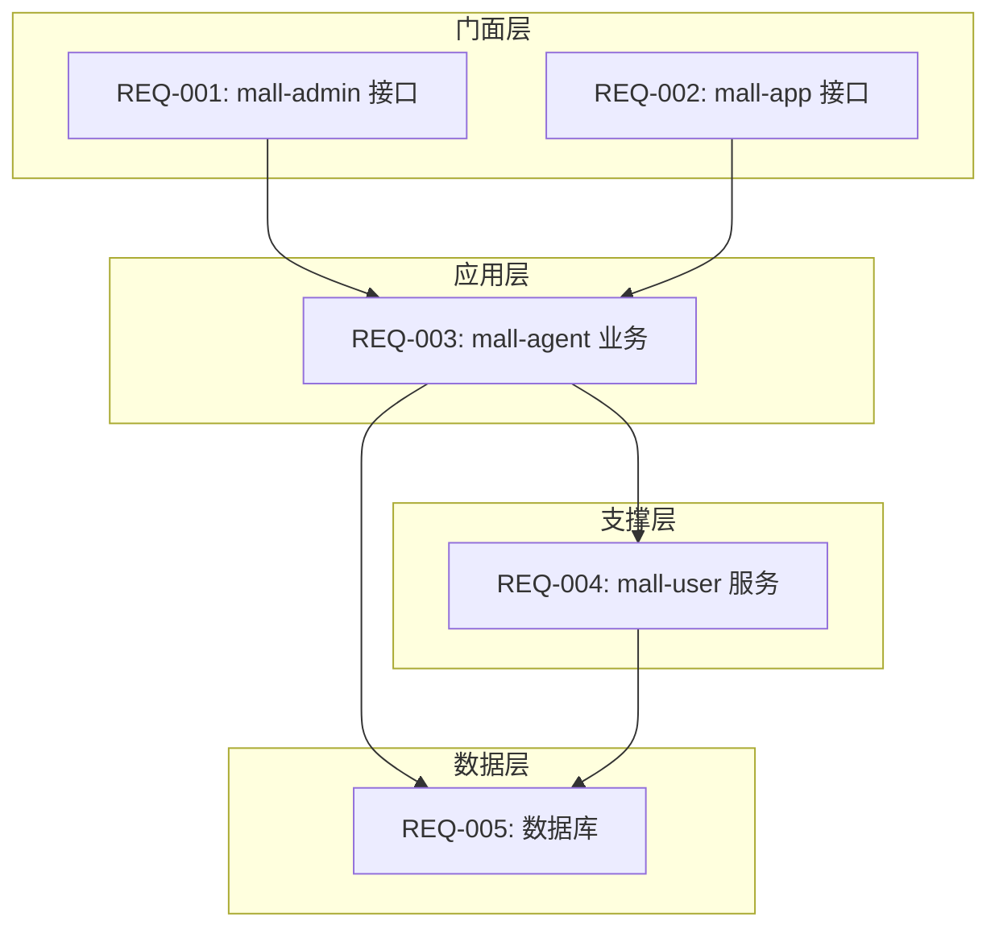

# PRD 需求分解 Skill

根据输入的 PRD 文档或一句话描述，按照规范进行需求拆解，生成包含子需求详细信息、依赖关系、代码位置、数据库表设计的需求分解文档。

> **注意**：本 Skill 遵循的规范定义在 `.qoder/rules/01-prd-decomposition.md`，包括服务归属判断规则、架构设计约束、服务调用关系等。

---

## 触发条件

- 用户提供了 PRD 文档路径或一句话需求描述
- 用户明确指令："分解需求" 或 "委托: 需求分解"
- 主 Agent 在 Phase 1 调用

---

## 输入

- PRD 文档路径（如 `inputs/prd/xxx-prd.md`）或一句话需求描述
- `orchestrator/ALWAYS/RESOURCE-MAP.yml` — 项目资源映射
- `.qoder/rules/01-prd-decomposition.md` — 需求拆分规范

---

## 输出

- 需求分解文档 → `orchestrator/PROGRAMS/{program_id}/workspace/decomposition.md`

---

## 工作流程

### Step 1: 读取输入

1. 读取 PRD 文档或解析一句话描述
2. 读取项目资源映射（RESOURCE-MAP.yml）
3. 读取需求拆分规范（01-prd-decomposition.md）

### Step 2: 功能分析

1. **解析 PRD 结构**
   - 提取功能模块列表
   - 识别用户故事和验收标准
   - 识别数据实体和业务流程

2. **识别调用入口**
   - 管理后台功能 → 标记 `[mall-admin]`
   - APP/商家端功能 → 标记 `[mall-app]`
   - AI 对话功能 → 标记 `[mall-chat]`

3. **识别业务归属**
   - 智能员工相关逻辑 → 标记 `[mall-agent]`
   - 用户相关操作 → 标记 `[mall-user]`

### Step 3: 逐模块拆分

对每个功能模块，按以下维度拆分：

| 维度 | 说明 | 输出标记 |
|------|------|----------|
| 门面接口-管理端 | 供管理后台调用的接口 | `[mall-admin]` |
| 门面接口-客户端 | 供 APP/商家端调用的接口 | `[mall-app]` |
| 门面接口-AI对话 | AI 对话功能 | `[mall-chat]` |
| 智能员工服务 | 智能员工核心业务逻辑 | `[mall-agent]` |
| 用户服务 | 用户相关数据操作 | `[mall-user]` |
| 数据库 | 表结构设计 | `[DB]` |
| 跨服务共享 | DTO、Feign 接口定义 | `[SHARED]` |

### Step 4: 依赖分析

分析以下内容并记录到各子需求中：

1. **服务调用链**：门面服务 → 应用服务 → 支撑服务
2. **模块依赖**：Controller → Service → Repository
3. **Feign 调用关系**：调用方依赖被调用方
4. **数据依赖**：哪些子需求依赖哪些数据库表

### Step 5: 生成需求分解文档

生成 `orchestrator/PROGRAMS/{program_id}/workspace/decomposition.md`：

```markdown
# 需求分解结果

## Program: P-YYYY-NNN-{feature-name}

### 需求概述

- **来源**: PRD 文档 / 一句话描述
- **功能模块**: xxx
- **涉及服务**: mall-admin, mall-app, mall-agent, mall-user

### 子需求列表

#### REQ-001: [mall-admin] xxx 接口

- **来源**: PRD 第 X.X 节
- **描述**: xxx
- **代码位置**: `repos/mall-admin/src/main/java/com/aim/mall/admin/controller/xxx.java`
- **接口路径**: `POST /admin/api/v1/xxx`
- **依赖模块**:
  - 依赖服务: mall-agent
  - 依赖数据库表: xxx
- **验收标准**:
  - [ ] 标准 1
  - [ ] 标准 2

#### REQ-002: [mall-app] xxx 接口

- **来源**: PRD 第 X.X 节
- **描述**: xxx
- **代码位置**: `repos/mall-app/src/main/java/com/aim/mall/app/controller/xxx.java`
- **接口路径**: `GET /app/api/v1/xxx`
- **依赖模块**:
  - 依赖服务: mall-agent
  - 依赖数据库表: xxx
- **验收标准**:
  - [ ] 标准 1
  - [ ] 标准 2

#### REQ-003: [mall-agent] xxx 业务逻辑

- **来源**: PRD 第 X.X 节
- **描述**: xxx
- **代码位置**: `repos/mall-agent/src/main/java/com/aim/mall/agent/service/xxx.java`
- **Inner 接口路径**: `POST /inner/api/v1/xxx`
- **依赖模块**:
  - 依赖服务: mall-user
  - 依赖数据库表: xxx
- **验收标准**:
  - [ ] 标准 1
  - [ ] 标准 2

#### REQ-004: [mall-user] xxx 服务

- **来源**: PRD 第 X.X 节
- **描述**: xxx
- **代码位置**: `repos/mall-user/src/main/java/com/aim/mall/user/feign/xxx.java`
- **Inner 接口路径**: `GET /inner/api/v1/xxx`
- **依赖模块**:
  - 依赖服务: 无
  - 依赖数据库表: xxx
- **验收标准**:
  - [ ] 标准 1
  - [ ] 标准 2

#### REQ-005: [DB] 数据库表设计

- **来源**: PRD 第 X.X 节
- **描述**: 设计 xxx 数据表
- **代码位置**: `repos/mall-agent/src/main/resources/db/Vxxx__xxx.sql`
- **涉及表**:
  - `xxx_table`: xxx 表
- **依赖模块**:
  - 被依赖: REQ-003, REQ-004
- **验收标准**:
  - [ ] 表结构设计
  - [ ] 索引设计
  - [ ] 字段注释

### 数据库设计汇总

#### 表清单

| 序号 | 表名 | 所属服务 | 用途 | 关联子需求 |
|------|------|----------|------|------------|
| 1 | xxx_table | mall-agent | xxx | REQ-003, REQ-005 |
| 2 | yyy_table | mall-user | yyy | REQ-004, REQ-005 |

#### 表结构详情

**xxx_table**

```sql
CREATE TABLE xxx_table (
    id BIGINT PRIMARY KEY AUTO_INCREMENT COMMENT '主键ID',
    -- 字段定义
    create_time DATETIME DEFAULT CURRENT_TIMESTAMP COMMENT '创建时间',
    update_time DATETIME DEFAULT CURRENT_TIMESTAMP ON UPDATE CURRENT_TIMESTAMP COMMENT '更新时间',
    deleted TINYINT DEFAULT 0 COMMENT '删除标记'
) COMMENT='xxx表';
```

### 依赖关系图



### 依赖矩阵

| 子需求 | 依赖服务 | 依赖数据库表 | 被谁依赖 |
|--------|----------|--------------|----------|
| REQ-001 | mall-agent | xxx_table | - |
| REQ-002 | mall-agent | xxx_table | - |
| REQ-003 | mall-user | xxx_table, yyy_table | REQ-001, REQ-002 |
| REQ-004 | - | yyy_table | REQ-003 |
| REQ-005 | - | - | REQ-003, REQ-004 |

### 开发顺序建议

1. **第一阶段**: REQ-005（数据库表设计）
2. **第二阶段**: REQ-004（mall-user 服务）
3. **第三阶段**: REQ-003（mall-agent 业务）
4. **第四阶段**: REQ-001, REQ-002（门面接口）

### 检查清单

- [ ] 所有 PRD 功能点都已覆盖
- [ ] 每个子需求都有明确的服务归属
- [ ] 接口入口正确区分（管理端 vs 客户端）
- [ ] Feign 调用关系已识别
- [ ] 依赖关系已明确标注
- [ ] 代码路径符合项目结构规范
- [ ] 数据库表设计已汇总
```

---

## 返回格式

```
状态：已完成
报告：orchestrator/PROGRAMS/{program_id}/workspace/decomposition.md
产出：1 个文件（需求分解文档）
决策点：无
```
