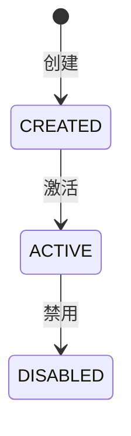

# 技术规格书生成 Skill

基于需求分解和澄清结果，生成详细的技术规格书（design.md）。支持迭代修正：当设计不满足要求时，接受用户补充上下文或修改意见，并智能判断是否需要同步更新需求文档。

> **注意**：本 Skill 遵循的规范定义在 `.qoder/rules/03-tech-spec-generation.md` 和 `.qoder/rules/05-architecture-standards.md`。

---

## 触发条件

- 用户指令："生成技术规格书" 或 "设计 SPEC"
- 当前 Program 为 Implementation 类型
- 需求澄清已完成（workspace/answers.md 已生成）

## Program 类型

本 Skill 适用于 **Implementation Program**（实现类型）。

示例：在 `P-2026-001-REQ-031` Program 中运行本 Skill

---

## 输入

- `orchestrator/PROGRAMS/{decomposition_program_id}/workspace/decomposition.md` — 需求分解文档
  - 从当前 Program ID 推导：如 `P-2026-001-REQ-031` → `P-2026-001-decomposition`
  - 提取当前 REQ 的定义
- `orchestrator/PROGRAMS/{current_program_id}/workspace/answers.md` — 需求澄清结果
- `orchestrator/PROGRAMS/{current_program_id}/workspace/decisions.md` — 技术决策记录
- `.qoder/rules/03-tech-spec-generation.md` — 技术规格规范
- `.qoder/rules/05-architecture-standards.md` — 架构规范
- 当前 Program 的 STATUS.yml — 更新阶段状态

---

## 输出

- 技术规格书 → `orchestrator/PROGRAMS/{current_program_id}/workspace/tech-spec.md`
- OpenAPI 定义 → `orchestrator/PROGRAMS/{current_program_id}/workspace/openapi.yaml`
- 验收清单 → `orchestrator/PROGRAMS/{current_program_id}/workspace/checklist.md`
- 更新 STATUS.yml → 阶段从"技术规格"更新为"代码生成"

---

## 工作流程

### Step 1: 读取输入文档

1. **推导 decomposition Program ID**
   - 当前 Program: `P-2026-001-REQ-031`
   - Decomposition Program: `P-2026-001-decomposition`

2. 读取需求分解文档（decomposition.md）
   - 只提取当前 REQ 相关的部分

3. 读取当前 Program 的需求澄清结果（workspace/answers.md）
4. 读取当前 Program 的技术决策记录（workspace/decisions.md）
5. 读取架构规范和编码规范
6. 检查 STATUS.yml 确认处于"技术规格"阶段

### Step 2: 分析依赖与上下文

**收集现有系统信息：**

```markdown
## 上下文收集清单

### 2.1 现有数据库设计
- [ ] 读取 repos/{service}/src/main/resources/db/ 现有表结构
- [ ] 识别需要复用的表
- [ ] 识别需要新增的表
- [ ] 识别需要修改的表（字段变更）

### 2.2 现有接口（Feign/HTTP）
- [ ] 搜索现有 Feign 接口定义
- [ ] 识别可复用的接口
- [ ] 识别需要新增的接口

### 2.3 三方文档/外部依赖
- [ ] 是否有第三方 API 文档
- [ ] 是否有消息队列 topic 定义
- [ ] 是否有缓存规范
```

### Step 3: 生成技术规格书（初稿）

按以下结构生成 `orchestrator/PROGRAMS/{current_program_id}/workspace/tech-spec.md`：

> 注意：针对单个 REQ 生成精简版技术规格，而非完整系统设计

```markdown
# 技术规格书

## 1. 概述

### 1.1 目标
### 1.2 背景
### 1.3 涉及子需求
### 1.4 技术选型理由

## 2. 数据模型设计

### 2.1 ER 图
### 2.2 表结构定义
### 2.3 表变更清单（新增/修改/删除）

## 3. API 接口定义

### 3.1 接口概览
### 3.2 接口详情（按服务分组）
### 3.3 Feign 接口定义
### 3.4 错误码规范

## 4. 架构设计

### 4.1 服务调用关系
### 4.2 时序图（关键流程）
### 4.3 代码结构

## 5. 业务规则实现

### 5.1 状态机设计
### 5.2 校验规则
### 5.3 业务逻辑流程

## 6. 验收标准

## 7. 附录

### 7.1 需求追溯矩阵
### 7.2 变更记录
```

### Step 4: 用户评审与迭代

**呈现技术规格书给用户：**

```
技术规格书已生成：orchestrator/PROGRAMS/{current_program_id}/workspace/tech-spec.md

本规格书针对单个 REQ 生成，包含该需求所需的：
- 数据模型设计（相关表）
- API 接口定义（该 REQ 涉及的接口）
- 业务规则实现

主要内容预览：
├── 数据模型: X 张表（Y 张新增，Z 张修改）
├── API 接口: N 个端点
├── 涉及服务: mall-admin, mall-app, mall-agent
└── 关键决策: [列出关键设计决策]

请评审技术规格书，如有以下情况请告知：
1. 需要补充上下文（现有表结构、接口文档等）
2. 设计方案需要调整
3. 缺少必要的实现细节
```

#### 4.1 处理用户反馈

**场景 A: 用户补充上下文**

```
User: 需要参考现有的用户表结构

Agent: 请提供现有用户表结构信息，或告诉我表结构文档路径

User: 路径是 repos/mall-user/.../db/V001__user.sql

Agent: 
1. 读取提供的表结构
2. 更新 design.md 中的数据模型设计
3. 如有必要，更新接口设计（字段映射等）
4. 标记修订记录
```

**场景 B: 用户要求修改设计方案**

```
User: 智能员工和技能的关系应该是一对多，不是多对多

Agent: 
1. 分析变更影响：
   - ER 图变更
   - 表结构变更（去掉中间表）
   - 接口变更（技能字段从数组变成对象）
   - Service 逻辑变更

2. 判断是否需要同步更新需求文档：
   
   【变更影响分析】
   - 数据库设计: 是（表结构变更）
   - 接口设计: 是（Request/Response 字段变更）
   - 依赖关系: 否
   - 业务规则: 是（澄清文档中的技能绑定规则）
   
   【需要同步更新】
   - workspace/decomposition.md: 更新 REQ-005 表设计
   - workspace/answers/REQ-001.md: 更新技能绑定确认结果
   - workspace/decisions/REQ-001.md: 新增技能关系决策

3. 询问用户确认：
   "此设计变更涉及需求确认结果的调整，是否同步更新澄清文档？"

4. 根据用户确认：
   - 更新 design.md
   - 如用户确认，同步更新需求相关文档
```

**场景 C: 用户要求补充实现细节**

```
User: 需要补充缓存策略

Agent:
1. 在 design.md 中新增"缓存设计"章节
2. 补充缓存 key 设计、过期策略、一致性保证
3. 如缓存涉及业务规则变更，判断是否需要更新需求文档
```

#### 4.2 变更影响分析矩阵

当设计发生变更时，使用以下矩阵判断是否需同步更新需求文档：

| 变更类型 | 影响范围 | 是否需更新需求文档 | 更新目标 |
|----------|----------|-------------------|----------|
| 数据库表名/字段变更 | 数据模型 | 是 | decomposition.md |
| 接口路径/方法变更 | API 设计 | 是 | decomposition.md |
| 接口字段增减 | API 设计 | 判断 | answers.md（如影响业务规则） |
| 依赖服务变更 | 架构设计 | 是 | decomposition.md |
| 状态机变更 | 业务逻辑 | 是 | answers.md, decisions.md |
| 校验规则变更 | 业务逻辑 | 是 | answers.md |
| 代码分层调整 | 实现细节 | 否 | - |
| 缓存/日志策略 | 技术实现 | 否 | - |

### Step 5: 生成关联文档

技术规格确认后，生成：

1. **OpenAPI 定义** (`workspace/api/openapi.yaml`)
   - 从 design.md 的接口定义提取
   - 包含所有门面服务和内部服务的接口

2. **验收清单** (`workspace/checklist.md`)
   - 按子需求组织验收项
   - 关联到 design.md 的具体章节

### Step 6: 建立双向追溯

**在 design.md 中建立需求追溯矩阵：**

```markdown
## 7.1 需求追溯矩阵

| 子需求 | 设计章节 | 数据库表 | API 接口 | 实现类 |
|--------|----------|----------|----------|--------|
| REQ-001 | 3.1, 4.2 | aim_employee | POST /admin/api/v1/agent | AgentAdminController |
| REQ-003 | 3.3, 4.2 | aim_employee | POST /inner/api/v1/agent | AgentService |
| REQ-005 | 2.2 | aim_employee, aim_skill | - | - |
```

---

## 迭代修正流程

```
┌─────────────────────────────────────────────────────────────────┐
│                     迭代修正循环                                 │
├─────────────────────────────────────────────────────────────────┤
│                                                                 │
│  ┌──────────────┐    用户反馈    ┌──────────────┐              │
│  │  design.md   │ ◄───────────── │    用户      │              │
│  │   初稿/修订   │                │              │              │
│  └──────┬───────┘                └──────────────┘              │
│         │                                                       │
│         ▼                                                       │
│  ┌─────────────────────────────────────┐                       │
│  │         变更影响分析                 │                       │
│  │  ┌─────────────┐ ┌─────────────┐   │                       │
│  │  │ 数据库变更? │ │ 接口变更?   │   │                       │
│  │  └──────┬──────┘ └──────┬──────┘   │                       │
│  │         └───────────────┘          │                       │
│  │                   │                │                       │
│  │                   ▼                │                       │
│  │         ┌─────────────────┐        │                       │
│  │         │ 需更新需求文档?  │        │                       │
│  │         └────────┬────────┘        │                       │
│  │                  │ 是              │                       │
│  │                  ▼                 │                       │
│  │  ┌─────────────────────────────┐  │                       │
│  │  │  更新 decomposition.md      │  │                       │
│  │  │  更新 answers/{req_id}.md   │  │                       │
│  │  │  更新 decisions/{req_id}.md │  │                       │
│  │  └─────────────────────────────┘  │                       │
│  └─────────────────────────────────────┘                       │
│         │                                                       │
│         ▼                                                       │
│  ┌──────────────┐                                              │
│  │ 更新 design.md │ ◄─────────────────────────────────────────┘
│  └──────────────┘              循环直到用户满意
│         │
│         ▼
│  ┌──────────────┐
│  │  生成关联文档  │
│  │ openapi.yaml │
│  │ checklist.md │
│  └──────────────┘
│
└─────────────────────────────────────────────────────────────────┘
```

---

## 技术规格书内容规范

### 1. 数据模型设计详细度要求

**每张表必须包含：**

```markdown
#### {表名} 表

**设计说明**: 
- 用途: xxx
- 数据量预估: xxx
- 关联子需求: REQ-xxx

**表结构**:

| 字段名 | 类型 | 约束 | 默认值 | 说明 |
|--------|------|------|--------|------|
| id | BIGINT | PK, AUTO_INCREMENT | - | 主键ID |
| name | VARCHAR(100) | NOT NULL | - | 名称 |
| status | TINYINT | - | 1 | 状态: 0-禁用 1-启用 |

**索引设计**:

| 索引名 | 类型 | 字段 | 说明 |
|--------|------|------|------|
| idx_name | UNIQUE | name | 名称唯一索引 |
| idx_status | NORMAL | status | 状态查询索引 |

**SQL DDL**:

```sql
CREATE TABLE xxx (...);
```
```

### 2. API 接口设计详细度要求

**每个接口必须包含：**

```markdown
#### {接口名}

**基本信息**:
- 路径: `POST /admin/api/v1/agent/create`
- 归属服务: mall-admin
- 调用方: 管理后台
- 关联子需求: REQ-001

**请求参数**:

| 字段 | 类型 | 必填 | 校验规则 | 说明 |
|------|------|------|----------|------|
| name | string | 是 | 长度1-100 | 智能员工名称 |
| skills | array | 是 | 至少1个元素 | 技能列表 |

**响应结果**:

| 字段 | 类型 | 说明 |
|------|------|------|
| id | long | 创建的智能员工ID |
| name | string | 名称 |

**业务逻辑**:
1. 校验名称唯一性
2. 校验技能列表非空
3. 调用 mall-agent 服务创建
4. 返回结果

**异常场景**:
| 异常 | 错误码 | 处理逻辑 |
|------|--------|----------|
| 名称重复 | AGENT_001 | 返回400，提示名称已存在 |
```

### 3. 业务规则实现详细度要求

**每个业务规则必须包含：**

```markdown
#### {规则名}

**规则描述**: xxx

**触发条件**: xxx

**处理逻辑**:
1. xxx
2. xxx

**校验规则**:
- 规则1: xxx
- 规则2: xxx

**状态流转**:


**实现位置**:
- Service 类: `AgentService.createAgent()`
- 校验器: `AgentValidator.validateNameUnique()`
```

---

## 返回格式

```
状态：已完成 / 需要迭代
报告：orchestrator/PROGRAMS/{current_program_id}/workspace/tech-spec.md
关联文档：
  - workspace/openapi.yaml
  - workspace/checklist.md

Program 状态更新：
  - current_phase: 代码生成
  - phases.技术规格.status: completed

产出变更：
  - 需求文档更新: 是/否
  - 更新文件列表: [xxx.md, yyy.md]
决策点：
  - 是否需要补充上下文: 是/否
  - 是否需要调整设计: 是/否
  - 是否进入代码生成阶段: 是/否
```
