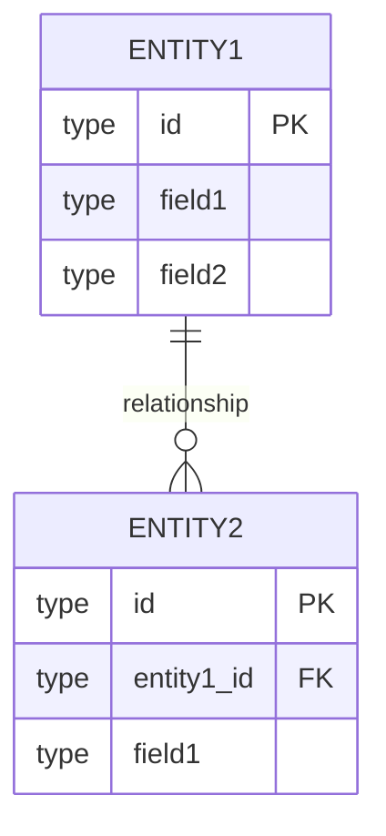
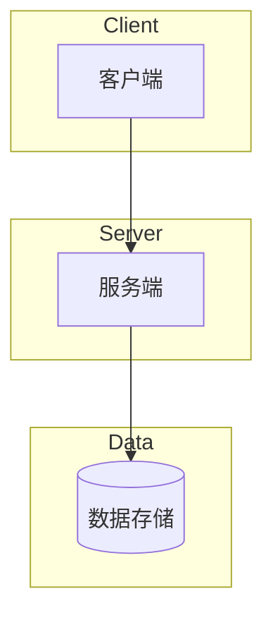
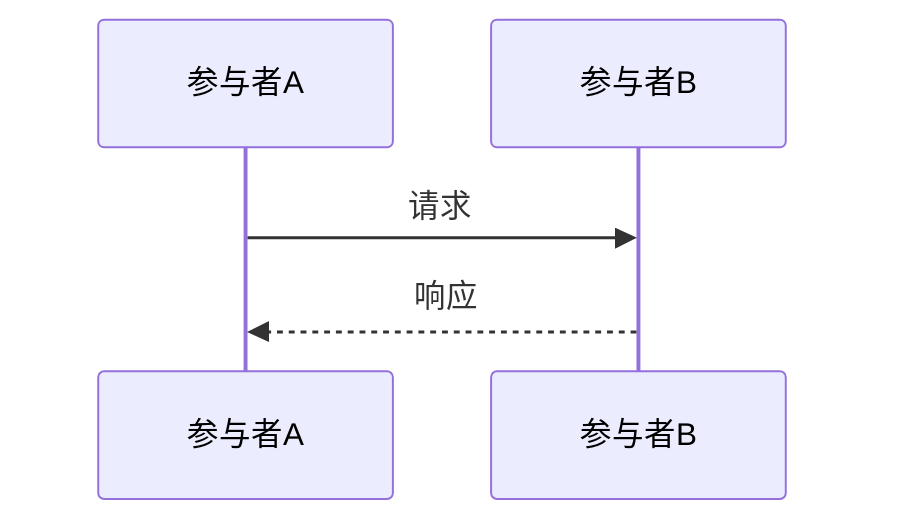

# 技术规格书模板

> 复制本模板到 `artifacts/spec/{program_id}/design.md` 并开始编辑

---

## 1. 概述

### 1.1 目标

{一句话描述本 Program 要实现的目标}

### 1.2 背景

- **关联 PRD**: {PRD 路径}
- **关联决策**: artifacts/spec/{program_id}/clarification/decisions.md
- **Program ID**: P-YYYY-NNN-{name}

### 1.3 技术选型理由

| 技术点   | 选型   | 理由   | 备选方案 |
|-------|------|------|------|
| {技术点} | {选型} | {理由} | {备选} |

---

## 2. 数据模型设计

### 2.1 ER 图



### 2.2 表结构定义

#### {表名} 表

```sql
CREATE TABLE {table_name}
(
    id
    UUID
    PRIMARY
    KEY
    DEFAULT
    gen_random_uuid
(
),
    -- 字段定义
    created_at TIMESTAMP DEFAULT CURRENT_TIMESTAMP,
    updated_at TIMESTAMP DEFAULT CURRENT_TIMESTAMP
    );

-- 索引
CREATE INDEX idx_{table} _{field} ON {table_name}({field});
```

---

## 3. API 接口定义

### 3.1 概览

| 端点         | 方法       | 描述   | 认证    |
|------------|----------|------|-------|
| {endpoint} | {METHOD} | {描述} | {是/否} |

### 3.2 OpenAPI 定义

完整 OpenAPI 3.0 定义见: `artifacts/spec/{program_id}/api/openapi.yaml`

### 3.3 错误码规范

| 错误码    | 描述   | HTTP 状态 |
|--------|------|---------|
| {CODE} | {描述} | {状态码}   |

---

## 4. 架构设计

### 4.1 系统架构图



### 4.2 时序图



---

## 5. 安全设计

### 5.1 {安全领域}

- {安全措施}

---

## 6. 验收标准

见 `artifacts/spec/{program_id}/checklist.md`

---

## 7. 附录

### 7.1 相关文档

- PRD: {PRD 路径}
- 需求拆分: artifacts/spec/{program_id}/requirements/decomposition.md
- 技术决策: artifacts/spec/{program_id}/clarification/decisions.md

### 7.2 变更记录

| 日期   | 版本   | 变更内容 | 作者   |
|------|------|------|------|
| {日期} | v1.0 | 初始版本 | {作者} |
