# AI智能体代理平台 — 产品需求文档（PRD）

## 一、需求概述

### 1.1 需求背景

现有电商平台入驻商家面临运营成本高、客服人力投入大等痛点。为降低商家运营门槛、激励平台用户参与推广，计划建设**AI智能体代理平台
**，将非标的"AI能力"转化为标准化的"岗位SOP"，允许用户申请成为"智能员工"，通过AI对话能力完成商品销售和客户咨询服务，并按销售业绩获取佣金收益。

### 1.2 需求目标

| 目标     | 描述            | 衡量指标        |
|--------|---------------|-------------|
| 降低运营成本 | 商家无需自建客服团队    | 商家客服人力成本下降  |
| 激励用户推广 | 用户通过智能员工获取佣金  | 智能员工活跃数、销售额 |
| 拉动平台增长 | 转发解锁机制带动拉新    | 邀请注册转化率     |
| 提升用户体验 | AI 7×24小时咨询服务 | 咨询响应速度、满意度  |

### 1.3 需求范围

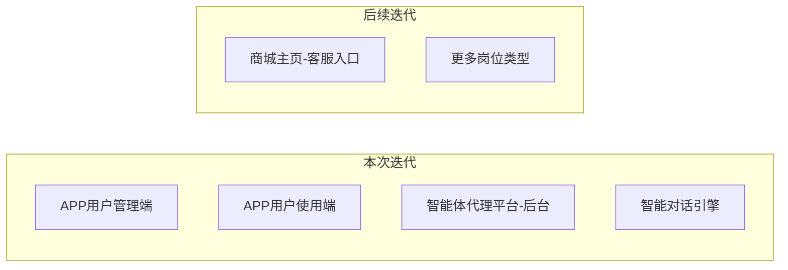

### 1.4 整体业务流程图

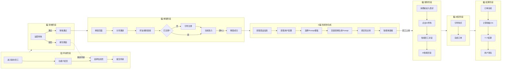

**简化版全局流程**

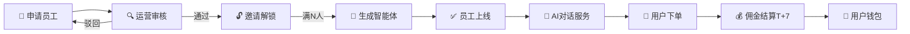

**核心业务流程说明**

| 阶段            | 参与角色    | 核心动作                        | 关键节点     |
|---------------|---------|-----------------------------|----------|
| 1. 申请阶段       | 平台用户    | 选择岗位/商品/风格 → 提交申请           | 名额检查     |
| 2. 审核阶段       | 运营人员    | 审核申请 → 通过/驳回                | 驳回需填原因   |
| 3. 解锁阶段       | 平台用户+好友 | 分享邀请 → 好友注册                 | 满N人解锁    |
| **3.5 智能体生成** | **系统**  | **获取配置 → 生成Prompt → 绑定知识库** | **自动触发** |
| 4. 服务阶段       | 消费者+AI  | 商品咨询 → AI智能回复               | 流式输出     |
| 5. 成交阶段       | 消费者     | 购买商品 → 完成订单                 | 订单归因     |
| 6. 结算阶段       | 系统      | 计算佣金 → T+7结算                | 1%佣金比例   |

---

## 二、用户角色

| 角色        | 描述          | 核心诉求            |
|-----------|-------------|-----------------|
| 平台用户（申请者） | APP注册用户     | 申请智能员工、获取销售佣金收益 |
| C端消费者     | 商品浏览/购买用户   | 获取商品咨询、购买决策支持   |
| 平台运营      | 智能体代理平台管理人员 | 管理岗位、审核员工、配置规则  |

### 用户等级与权限

| 等级 | 定义           | 初始名额 |
|----|--------------|------|
| A级 | 已注册用户        | 0个   |
| B级 | 完成至少一次登录     | 1个   |
| C级 | 有已完成订单       | 1个   |
| D级 | 成功拉新（邀请他人注册） | 2个   |
| E级 | 同时满足下单和拉新    | 3个   |

---

## 三、APP端 — 用户管理端

### 3.1 智能员工申请

#### 3.1.1 功能说明

用户通过「我的员工」入口申请创建智能员工，完成配置后通过分享解锁。

#### 3.1.2 入口位置

| 位置     | 说明         |
|--------|------------|
| APP侧边栏 | 新增「我的员工」入口 |

#### 3.1.3 申请流程

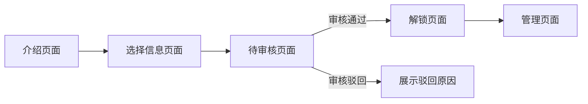

#### 3.1.4 页面详述

**U-001 功能介绍页**

| 元素   | 说明              |
|------|-----------------|
| 功能介绍 | 图文介绍智能员工功能及收益模式 |
| 申请入口 | 「立即申请」按钮        |
| 名额提示 | 展示"当前可用名额：X个"   |
| 解锁提示 | 无名额时提示如何获取名额    |

**U-002 选择信息页（单页完成）**

| 配置项   | 类型   | 说明                | 数据来源                                    |
|-------|------|-------------------|-----------------------------------------|
| 岗位类型  | 单选   | 商品销售 / 商城客服       | 岗位管理                                    |
| 类目选择  | 级联选择 | 当岗位=商品销售时显示       | **类目配置**（通过商品服务热门类目实现，支持前端类目与后端商品类目的映射） |
| 商品选择  | 搜索选择 | 当岗位=商品销售时显示，选择SPU | **代理商品配置**（新增）                          |
| 人设/风格 | 单选   | 5个默认风格选项          | 系统预置                                    |
| 商务合作信息 | 文本输入 | 详细的商务合作计划和盈利模式说明 | 用户填写，供审核人员评估                      |
| 社交平台链接 | 文本输入 | 个人社交媒体主页链接或截图上传 | 支持微信、微博、抖音等主流平台，用于验证用户影响力 |

**人设/风格选项**（默认5个）

| 风格   | 描述                |
|------|-------------------|
| 专业严谨 | 专业术语、数据支撑、逻辑清晰    |
| 活泼亲切 | 生动表达、emoji使用、轻松氛围 |
| 温柔贴心 | 关怀询问、细致周到、耐心解答    |
| 简洁高效 | 直击重点、快速响应、节省时间    |
| 热情洋溢 | 积极推荐、主动服务、感染力强    |

**U-002.5 待审核页面** 🆕

| 元素   | 说明                        |
|------|---------------------------|
| 员工信息 | 展示员工编号、名称、岗位、关联商品         |
| 审核状态 | "审核中，请耐心等待" 或 "审核未通过"     |
| 驳回原因 | 审核未通过时展示具体驳回原因（由后台审核人员填写） |
| 操作按钮 | 审核中：无；审核未通过：「重新申请」        |
| 沙盒预览 | 「预览体验」入口                  |

> [!NOTE]
> 审核通过后自动跳转到解锁页面（U-003），用户无需手动操作

**U-003 解锁页面**

| 元素   | 说明                  |
|------|---------------------|
| 解锁进度 | 展示"已邀请 X / Y 人"     |
| 分享按钮 | 生成分享素材              |
| 分享渠道 | 微信好友 / 朋友圈 / 小程序卡片  |
| 海报预览 | 预览分享海报              |
| 沙盒入口 | 「预览体验」按钮，锁定状态下可体验对话 |

#### 3.1.5 解锁机制

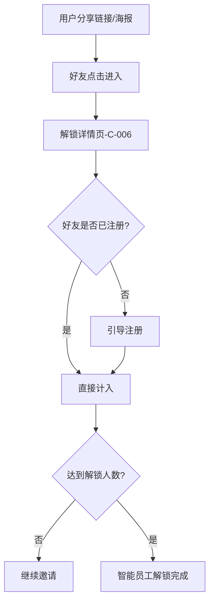

| 规则项  | 说明                |
|------|-------------------|
| 解锁人数 | 默认3人，后台可配置        |
| 计入条件 | 好友通过链接进入并**完成注册** |
| 锁定状态 | 可沙盒预览体验对话，无法正式上线  |

---

### 3.2 智能员工管理

#### 3.2.1 功能说明

用户管理已创建的智能员工，查看业务数据，进行话术、知识库等配置。

#### 3.2.2 页面布局

```
┌────────────────────────────────────────────────────────────┐
│  顶部：核心数据概览                                         │
│  ┌──────────┬──────────┬──────────┬──────────┐            │
│  │ 员工总数  │ 今日咨询  │ 累计收益  │ 本月收益  │            │
│  │    3     │    56    │  ¥2,350  │  ¥680   │            │
│  └──────────┴──────────┴──────────┴──────────┘            │
├────────────────────────────────────────────────────────────┤
│  中部：智能员工列表                                         │
│  ┌────────────────────────────────────────────────────┐   │
│  │ [头像] 员工名称                         [状态标签]  │   │
│  │ 商品：iPhone 16 Pro                                │   │
│  │ 咨询量：128  调用量：89  转化率：12.3%             │   │
│  │                              [查看] [编辑] [下线]  │   │
│  └────────────────────────────────────────────────────┘   │
│  ┌────────────────────────────────────────────────────┐   │
│  │ [头像] 员工名称                         [状态标签]  │   │
│  │ ...                                               │   │
│  └────────────────────────────────────────────────────┘   │
├────────────────────────────────────────────────────────────┤
│  底部：管理功能入口                                         │
│  ┌──────────┐ ┌──────────┐ ┌──────────┐ ┌──────────┐     │
│  │ 对话记录  │ │ 话术管理  │ │ 知识库   │ │ 收益管理  │     │
│  └──────────┘ └──────────┘ └──────────┘ └──────────┘     │
└────────────────────────────────────────────────────────────┘
```

#### 3.2.3 员工列表字段

| 字段    | 说明                  |
|-------|---------------------|
| 头像/名称 | 智能员工展示信息            |
| 关联商品  | SPU名称（商品销售岗位）       |
| 状态    | 待解锁/待审核/已上线/已暂停/已封禁 |
| 咨询量   | 累计对话轮次              |
| 调用量   | 累计API调用次数           |
| 转化率   | 咨询→下单转化率            |
| 操作    | 查看/编辑/下线            |

#### 3.2.4 子功能页面

**对话记录（U-005/U-006）**

| 功能   | 说明         |
|------|------------|
| 列表筛选 | 按员工/时间范围筛选 |
| 对话详情 | 查看完整对话内容   |
| 导出功能 | 暂不支持       |

**话术管理（U-007/U-008）**

| 功能   | 说明         |
|------|------------|
| 话术列表 | 展示所有自定义话术  |
| 新增话术 | 添加问答对或话术模板 |
| 编辑话术 | 修改已有话术     |
| 删除话术 | 删除话术       |
| 审核状态 | 展示话术审核状态   |

**知识库（U-009/U-010）**

| 功能   | 说明                   |
|------|----------------------|
| 文件列表 | 展示已上传文件              |
| 文件上传 | 支持PDF/Word/TXT/Excel |
| 文件大小 | 单文件≤10MB             |
| 解析状态 | 展示文件解析进度             |
| 审核状态 | 展示知识库审核状态            |

**收益管理（U-011）**

| 功能   | 说明       |
|------|----------|
| 入口   | 跳转「钱包」模块 |
| 收益明细 | 复用钱包收益明细 |
| 提现   | 复用钱包提现功能 |

**沙盒预览**

> 智能员工锁定状态下，申请者可预览体验对话效果

| 规则项  | 说明                        |
|------|---------------------------|
| 入口   | 解锁页面「预览体验」按钮 / 员工卡片「预览」按钮 |
| 对话限制 | 无限制，仅申请者可用                |
| 数据记录 | 不计入正式统计                   |
| 对话界面 | 复用正式对话界面，顶部显示「沙盒模式」标识     |

---

## 四、APP端 — 用户使用端

### 4.1 商品导购入口

#### 4.1.1 入口位置

| 位置    | 说明          |
|-------|-------------|
| 商品详情页 | **左下角悬浮按钮** |

**按钮设计规范** 🆕

| 元素   | 说明                           |
|------|------------------------------|
| 按钮形态 | IP形象头像（智能员工卡通形象）             |
| 尺寸规格 | 56×56px，圆形按钮                 |
| 视觉元素 | 机器人头像 + 微小对话气泡标识             |
| 动效   | 入场时微微跳动动效，吸引注意               |
| 文字提示 | 首次展示时显示"AI导购"文字气泡提示（2秒后自动收起） |
| 点击反馈 | 点击时缩放动效                      |

#### 4.1.2 入口逻辑

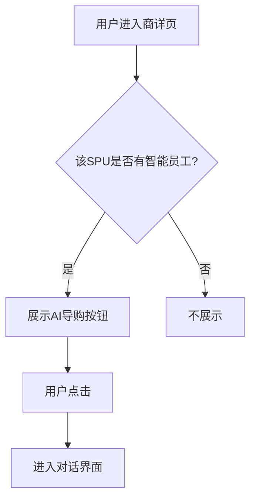

### 4.2 对话界面

#### 4.2.1 功能说明

用户与智能员工进行实时对话咨询。

#### 4.2.2 界面元素

| 元素   | 说明           |
|------|--------------|
| 员工信息 | 头像、名称、风格标签   |
| 商品卡片 | 关联商品信息展示     |
| 对话区域 | 消息列表，流式输出    |
| 输入区域 | 文本输入框 + 发送按钮 |
| 功能按钮 | 评分、举报        |

#### 4.2.3 对话流程（含话术/知识库命中）

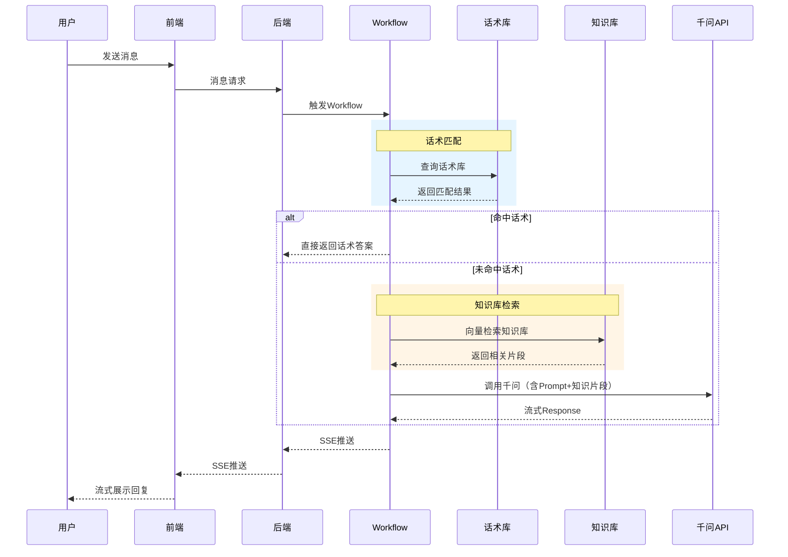

**命中逻辑说明** 🆕

| 步骤       | 说明                          |
|----------|-----------------------------|
| 1. 话术匹配  | 优先匹配用户配置的话术库，相似度≥0.85则命中    |
| 2. 知识库检索 | 未命中话术时，检索知识库获取Top3相关片段      |
| 3. LLM生成 | 将知识片段注入Prompt，调用千问生成回答      |
| 4. 回复标识  | 回复消息标识来源：「话术」或「AI生成」（仅后台可见） |

### 4.3 评分与举报

**评分弹窗（C-004）**

| 元素   | 说明           |
|------|--------------|
| 触发时机 | 对话结束后或用户主动点击 |
| 评分维度 | 1-5星评分       |
| 评价标签 | 快捷评价标签（可多选）  |
| 文字反馈 | 可选填写         |

**举报弹窗（C-005）**

| 元素   | 说明                 |
|------|--------------------|
| 举报类型 | 虚假信息/违规内容/服务态度差/其他 |
| 举报说明 | 必填文本               |
| 截图上传 | 可选                 |

### 4.4 解锁详情页（C-006）

#### 4.4.1 功能说明

好友点击分享链接后进入的落地页。

| 元素         | 说明                                     |
|------------|----------------------------------------|
| 邀请人信息      | 展示邀请人头像、昵称                             |
| **智能员工信息** | 员工编号（如 **AIM001**）、员工名称、员工头像、岗位类型、人设风格 |
| 关联商品       | 商品图片、名称、价格（商品销售岗位）                     |
| 解锁进度       | 已解锁 X / Y 人                            |
| 解锁按钮       | 「帮TA解锁」按钮                              |
| 注册引导       | 未注册用户引导注册                              |

---

## 五、智能体代理平台 — 管理后台

### 5.1 首页仪表盘（A-001）

#### 5.1.1 核心指标卡片（含取数逻辑） 📥

| 指标     | 说明           | 取数逻辑                                   | 计算公式                                                                       |
|--------|--------------|----------------------------------------|----------------------------------------------------------------------------|
| 智能员工总数 | 累计创建数量       | `aim_ai_employee` 表 `status != 4(已封禁)` | `COUNT(id)`                                                                |
| 已上线员工  | 当前上线状态数量     | `aim_ai_employee` 表 `status = 2(已上线)`  | `COUNT(id) WHERE status=2`                                                 |
| 今日咨询量  | 今日对话轮次       | `conversation` 表今日记录                   | `SUM(turn_count) WHERE DATE(created_at)=TODAY`                             |
| 今日成交额  | 今日智能员工成交订单金额 | `order` 表关联员工今日已完成订单                   | `SUM(order_amount) WHERE employee_id IS NOT NULL AND DATE(pay_time)=TODAY` |
| 待审核数量  | 待审员工+话术+知识库  | 多表统计                                   | `COUNT(待审员工) + COUNT(待审话术) + COUNT(待审知识库)`                                 |

**指标卡片设计** 🆕

| 指标     | 图标 | 颜色 | 辅助信息         |
|--------|----|----|--------------|
| 智能员工总数 | 🤖 | 蓝色 | 环比昨日增率       |
| 已上线员工  | ✅  | 绿色 | 占总数百分比       |
| 今日咨询量  | 💬 | 橙色 | 环比昨日增率       |
| 今日成交额  | 💰 | 紫色 | 环比昨日增率       |
| 待审核数量  | ⚠️ | 红色 | 告警标识（>10时高亮） |

#### 5.1.2 趋势图表

| 图表     | 说明          |
|--------|-------------|
| 员工增长趋势 | 近7/30天新增员工数 |
| 咨询量趋势  | 近7/30天咨询量变化 |
| 成交额趋势  | 近7/30天成交额变化 |

---

### 5.2 岗位管理（A-002/A-003）

#### 5.2.1 功能说明

管理智能员工的岗位类型，支持扩展。

#### 5.2.2 列表字段

| 字段    | 说明          |
|-------|-------------|
| 岗位ID  | 系统自动生成      |
| 岗位名称  | 如：商品销售、商城客服 |
| 岗位描述  | 岗位职责说明      |
| 关联员工数 | 该岗位下的员工数量   |
| 状态    | 启用/禁用       |
| 操作    | 编辑、启用/禁用    |

#### 5.2.3 表单字段

| 字段   | 类型   | 必填 | 说明      |
|------|------|----|---------|
| 岗位名称 | 文本   | ✅  | 最多20字符  |
| 岗位描述 | 多行文本 | ✅  | 最多200字符 |
| 状态   | 开关   | -  | 默认启用    |

---

### 5.3 名额配置（A-004）

#### 5.3.1 功能说明

配置不同用户等级的初始名额及销售额解锁规则。

#### 5.3.2 等级初始名额配置

| 用户等级 | 初始名额 | 可编辑 |
|------|------|-----|
| A    | 0    | ✅   |
| B    | 1    | ✅   |
| C    | 1    | ✅   |
| D    | 2    | ✅   |
| E    | 3    | ✅   |

#### 5.3.3 销售额解锁规则

| 配置项  | 说明                     |
|------|------------------------|
| 计算维度 | 按用户+SPU累计              |
| 解锁阈值 | 多级阈值配置（如10万+2个、20万+2个） |
| 解锁上限 | 500万（可配置）              |

#### 5.3.4 解锁人数配置

| 配置项  | 说明    |
|------|-------|
| 默认人数 | 3人    |
| 配置范围 | 1-10人 |

---

### 5.4 代理商品配置（A-005）🆕

#### 5.4.1 功能说明

配置可供用户申请代理的商品池，支持批量导入，展示代理状态。同时提供类目配置功能，用于设置前端展示类目与后端商品类目的映射关系。

#### 5.4.2 列表字段

| 字段     | 说明              |
|--------|-----------------|
| 商品ID   | SPU ID          |
| 商品名称   | SPU名称           |
| 商品图片   | 主图缩略图           |
| 所属类目   | 商品所属类目          |
| 代理状态   | 未代理 / 已代理       |
| 代理智能员工 | 已代理时展示员工名称+所属用户 |
| 上架时间   | 商品加入代理池的时间      |
| 操作     | 移除（仅未代理状态可操作）   |

#### 5.4.3 批量导入功能

| 功能   | 说明                           |
|------|------------------------------|
| 导入方式 | Excel文件上传                    |
| 模板下载 | 提供导入模板                       |
| 类目配置 | 提供类目配置功能，可设置前端类目与后端商品类目的映射关系 |
| 必填字段 | 商品ID（SPU ID）                 |
| 校验规则 | 商品ID必须存在于商品库                 |
| 导入结果 | 显示成功/失败/跳过数量                 |

#### 5.4.4 筛选条件

| 筛选项  | 说明             |
|------|----------------|
| 代理状态 | 全部 / 未代理 / 已代理 |
| 类目   | 类目树筛选          |
| 商品名称 | 关键词搜索          |

#### 5.4.5 业务规则

| 规则   | 说明               |
|------|------------------|
| 代理限制 | 一个SPU只能被一个智能员工代理 |
| 移除限制 | 已被代理的商品不可移除      |
| 状态联动 | 智能员工下线/封禁后释放代理关系 |

#### 5.4.6 类目配置功能

| 配置项  | 说明                                     |
|------|----------------------------------------|
| 功能说明 | 配置前端展示类目与后端商品类目的映射关系，一个前端类目可对应多个后端商品类目 |
| 热门类目 | 使用商品服务提供的热门类目作为前端展示类目                  |
| 类目映射 | 维护前端类目与后端类目的对应关系                       |
| 商品展示 | 在商品选择界面，按前端类目聚合展示其对应的后端类目商品            |

---

### 5.5 激活记录管理（A-017）🆕

#### 5.5.1 功能说明

管理用户激活智能员工申请权限的记录，控制用户发起智能员工申请的入口。

#### 5.5.2 激活流水列表字段

| 字段       | 说明               |
|----------|------------------|
| 流水ID     | 系统自动生成的流水号       |
| 邀请者(发起人) | 发起邀请的用户ID/昵称     |
| 被邀请人(用户) | 被邀请的用户ID/昵称      |
| 关联智能员工   | 关联的智能员工编号/名称     |
| 激活方式     | 邀请激活/手动激活        |
| 操作人      | 执行激活操作的用户（系统/运营） |
| 激活时间     | 激活操作的时间戳         |

#### 5.5.3 搜索条件

| 筛选项    | 说明                   |
|--------|----------------------|
| 邀请人搜索  | 按邀请人的ID或昵称进行模糊搜索     |
| 被邀请人搜索 | 按被邀请人的ID或昵称进行模糊搜索    |
| 智能员工搜索 | 按关联智能员工的编号或名称进行模糊搜索  |
| 激活类型   | 按激活方式进行筛选（邀请激活/手动激活） |
| 激活时间范围 | 按激活时间进行范围筛选          |

#### 5.5.4 手动新增激活记录

| 字段     | 类型       | 必填 | 说明          |
|--------|----------|----|-------------|
| 被邀请人   | 用户搜索选择   | ✅  | 选择一个被邀请用户   |
| 关联智能员工 | 智能员工搜索选择 | ✅  | 选择一个关联的智能员工 |
| 激活方式   | 只读       | -  | 固定为"手动激活"   |
| 邀请者    | 只读       | -  | 固定为"系统"     |

**业务规则** 🆕

| 规则项    | 说明                |
|--------|-------------------|
| 手动激活权限 | 仅运营人员可执行手动激活操作    |
| 邀请者默认值 | 手动激活时，邀请者默认为"系统"  |
| 重复激活检查 | 防止同一用户对同一智能员工重复激活 |

---

### 5.6 智能员工审核（A-006/A-007）

#### 5.6.1 功能说明

审核用户提交的智能员工申请。

#### 5.6.2 列表字段

| 字段   | 说明          |
|------|-------------|
| 申请ID | 系统自动生成      |
| 申请人  | 用户昵称/ID     |
| 岗位类型 | 商品销售/商城客服   |
| 关联商品 | SPU名称       |
| 人设风格 | 选择的风格       |
| 申请时间 | 提交时间        |
| 状态   | 待审核/已通过/已驳回 |
| 操作   | 查看详情、通过、驳回  |

#### 5.6.3 审核详情

| 元素       | 说明            |
|----------|---------------|
| 基本信息     | 申请人、岗位、商品等    |
| Prompt预览 | 系统生成的Prompt内容 |
| 审核操作     | 通过/驳回+驳回原因    |

**驳回原因配置** 🆕

| 配置项   | 说明                                |
|-------|-----------------------------------|
| 必填性   | 驳回时必须填写驳回原因                       |
| 快捷选项  | 预设常用驳回原因："商品信息不符""人设不当""资料不全""其他" |
| 自定义填写 | 支持补充填写具体原因，最多200字                 |
| 用户端展示 | 驳回原因同步展示在用户端待审核页面（U-002.5）        |
| 通知方式  | APP推送 + 站内信                       |

---

### 5.7 智能员工管理（A-008/A-009/A-010）

#### 5.7.1 功能说明

管理所有智能员工的状态、佣金、Prompt等。

#### 5.7.2 列表字段

| 字段   | 说明                  |
|------|---------------------|
| 员工ID | 系统自动生成              |
| 员工名称 | 展示名称                |
| 所属用户 | 申请人                 |
| 岗位类型 | 商品销售/商城客服           |
| 关联商品 | SPU名称               |
| 状态   | 待解锁/待审核/已上线/已暂停/已封禁 |
| 佣金比例 | 当前配置比例              |
| 累计收益 | 该员工产生的总收益           |
| 操作   | 详情、编辑、状态变更          |

#### 5.7.3 状态变更操作

| 操作 | 触发        | 影响           | 可逆性 |
|----|-----------|--------------|-----|
| 上线 | 审核通过+解锁完成 | 开始提供服务       | ✅   |
| 暂停 | 运营操作      | 无法服务+收益暂停    | ✅   |
| 恢复 | 运营操作      | 恢复服务         | -   |
| 警告 | 运营操作      | 发送APP系统消息    | -   |
| 封禁 | 运营操作      | 释放SPU绑定+名额占用 | ❌   |

#### 5.7.4 Prompt管理（A-010）

| 功能       | 说明            |
|----------|---------------|
| 查看Prompt | 展示当前生效的Prompt |
| 编辑Prompt | 运营可直接编辑，用户不可见 |
| 模板管理     | 管理Prompt模板库   |

#### 5.7.5 人设风格管理（A-016）

##### 5.7.5.1 功能说明

运营人员可以在后台管理系统中管理人设风格，包括新增、编辑、删除人设风格。

##### 5.7.5.2 风格列表字段

| 字段         | 说明             |
|------------|----------------|
| 图标 (Emoji) | 风格对应的图标        |
| 风格名称       | 风格的名称          |
| 描述         | 风格的详细描述        |
| Prompt 预览  | 该风格对应的Prompt预览 |
| 状态         | 风格的启用/禁用状态     |
| 排序         | 风格在列表中的排序      |
| 操作         | 修改、删除          |

##### 5.7.5.3 搜索功能

可以根据风格名称进行分页搜索。

##### 5.7.5.4 新增和修改字段

| 字段         | 说明             |
|------------|----------------|
| 图标 (Emoji) | 风格对应的图标        |
| 风格名称       | 风格的名称          |
| 描述         | 风格的详细描述        |
| Prompt 预览  | 该风格对应的Prompt预览 |
| 状态         | 风格的启用/禁用状态     |
| 排序         | 风格在列表中的排序      |

---

### 5.8 内容审核（A-011/A-012/A-013/A-014)

#### 5.8.1 对话记录审核

**列表字段定义**

| 字段   | 类型     | 说明              | 示例                  |
|------|--------|-----------------|---------------------|
| 用户ID | String | 消费者用户ID         | U20001              |
| 会话ID | String | 对话会话唯一标识        | CONV001             |
| 参与方  | String | 智能员工名称 + 消费者标识  | 智能导购-小美 vs 张先生      |
| 轮次   | Number | 对话往返轮数          | 8                   |
| 评分   | Number | 用户评分（1-5分）      | 4.5                 |
| 举报   | Badge  | 是否被举报（null/已举报） | 已举报（红色）             |
| 摘要   | String | 对话最后一条消息摘要      | 好的，我已经为您推荐了几款适合的... |
| 状态   | Badge  | 审核状态（正常/违规/待审核） | 正常（绿色）              |
| 操作   | Button | 查看详情按钮          | 👁                  |

**功能说明**

| 功能   | 说明            |
|------|---------------|
| 分类筛选 | 平台导购/商品导购     |
| 抽检模式 | 事后抽检，运营每日定期审核 |
| 违规标记 | 标记违规对话        |
| 处罚触发 | 关联员工处罚操作      |
| 仅看举报 | 筛选显示被举报的对话    |
| 时间范围 | 按对话时间筛选       |

#### 5.8.2 话术审核

**列表字段定义**

| 字段   | 类型         | 说明            | 示例                           |
|------|------------|---------------|------------------------------|
| 用户ID | String     | 提交话术的用户ID     | U10001                       |
| 提交人  | String     | 智能员工名称 + 员工编号 | 智能导购-小美<br/>EMP001           |
| 话术名称 | String     | 话术问题/触发语句     | 这款西装的材质是什么？                  |
| 话术内容 | String     | 话术回复内容（可展开查看） | 这款西装采用100%进口羊毛面料，手感柔软细腻...   |
| 相似度  | Percentage | 与现有话术库的相似度    | 15%（绿色）/ 45%（橙色）/ 80%+（红色警告） |
| 提交时间 | DateTime   | 话术提交时间        | 2025-12-20 10:30             |
| 操作   | Buttons    | 通过/驳回按钮       | ✓ 通过 / ✗ 驳回                  |

**功能说明**

| 功能       | 说明          |
|----------|-------------|
| 待审核列表    | 用户提交的话术     |
| 审核操作     | 通过/驳回+原因    |
| 批量操作     | 支持批量通过      |
| 相似度预警    | 相似度>60%高亮警告 |
| 内容展开     | 长文本支持展开/收起  |
| **话术模板** | 维护入口（右上角按钮） |

**话术模板管理（A-015）**

> 运营可预设常用话术模板，用户申请智能员工时可一键引用模板。

**模板字段定义**

| 字段   | 类型       | 必填 | 说明                 | 示例                                    |
|------|----------|----|--------------------|---------------------------------------|
| 模板ID | String   | 自动 | 系统自动生成             | TPL001                                |
| 话术名称 | String   | 是  | 模板标题（≤50字符）        | 商品材质咨询                                |
| 触发条件 | String   | 是  | 触发话术的问题关键词（≤200字符） | 材质、面料、成分、原料                           |
| 话术内容 | Text     | 是  | 话术回复内容（≤500字符）     | 这款产品采用{material}材质，具有{features}等特点... |
| 适用岗位 | Enum     | 是  | 适用的岗位类型            | 商品销售 / 商城客服 / 全部                      |
| 状态   | Boolean  | 是  | 启用/禁用              | 启用                                    |
| 创建时间 | DateTime | 自动 | 模板创建时间             | 2025-12-20 10:30                      |

**模板操作**

| 操作    | 说明               |
|-------|------------------|
| 新增模板  | 点击"新建"按钮，填写表单    |
| 编辑模板  | 点击行操作"编辑"，右侧抽屉表单 |
| 删除模板  | 点击行操作"删除"，二次确认   |
| 启用/禁用 | 列表中直接切换Switch    |
| 批量导入  | 支持Excel批量导入模板    |

#### 5.8.3 知识库审核

**列表字段定义**

| 字段    | 类型       | 说明            | 示例                                          |
|-------|----------|---------------|---------------------------------------------|
| 用户ID  | String   | 提交文件的用户ID     | U10001                                      |
| 文件名   | String   | 上传的文件名（带图标）   | 📄 产品使用手册.pdf                               |
| 类型/大小 | String   | 文件类型 + 文件大小   | PDF<br/>2.34 MB                             |
| 解析状态  | Badge    | 文件解析进度状态      | ✅ 15切片（成功）<br/>⏳ 解析中...（进度条）<br/>❌ 解析失败（红色） |
| 提交人   | String   | 智能员工名称 + 员工编号 | 智能导购-小美<br/>EMP001                          |
| 提交时间  | DateTime | 文件提交时间        | 2025-12-20 10:30                            |
| 预览    | Button   | 预览文件内容按钮      | 👁                                          |
| 操作    | Buttons  | 通过/驳回按钮       | ✓ 通过 / ✗ 驳回                                 |

**解析状态枚举**

| 状态     | 颜色 | 说明          |
|--------|----|-------------|
| X 切片   | 绿色 | 解析成功，显示切片数量 |
| 解析中... | 蓝色 | 正在解析，显示进度条  |
| 解析失败   | 红色 | 解析失败，需重新上传  |

**功能说明**

| 功能    | 说明              |
|-------|-----------------|
| 待审核列表 | 用户上传的文件         |
| 文件预览  | 预览文件内容及解析切片     |
| 审核操作  | 通过/驳回+原因        |
| 支持格式  | PDF、DOCX、MD、TXT |

---

## 六、技术架构

### 6.1 对话引擎架构（含话术/知识库命中）

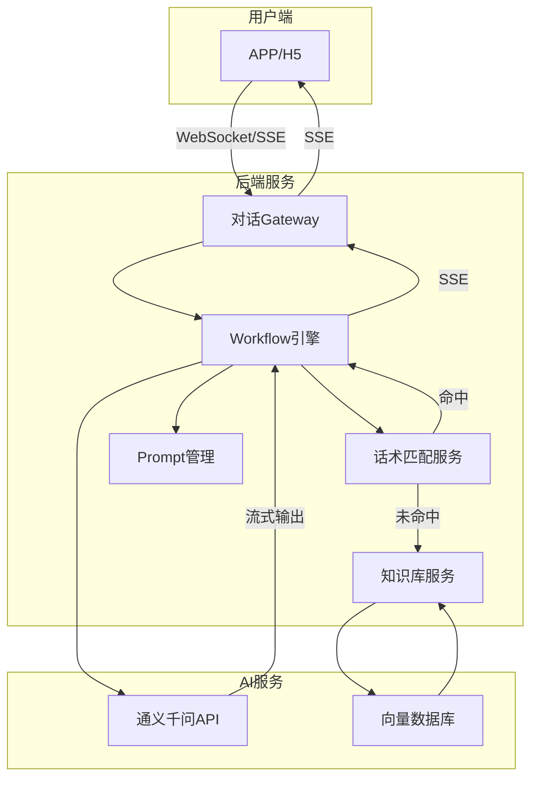

**对话处理流程详细说明**

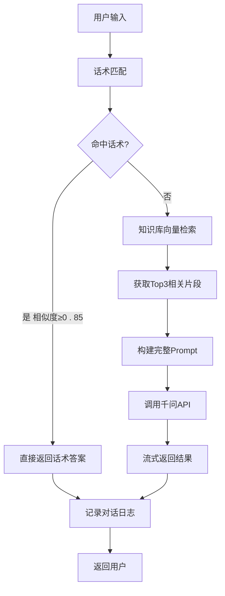

| 步骤          | 说明              | 技术实现                          |
|-------------|-----------------|-------------------------------|
| 1. 话术匹配     | 优先查询用户配置的话术库    | Elasticsearch全文索引 + 语义相似度计算   |
| 2. 知识库检索    | 向量化用户问题，检索知识库   | text-embedding-v2 + Milvus向量库 |
| 3. Prompt组装 | 将知识片段注入Prompt模板 | Workflow变量替换                  |
| 4. LLM生成    | 调用千问API生成回答     | qwen-turbo 流式调用               |

### 6.2 Prompt动态生成（完整流程）

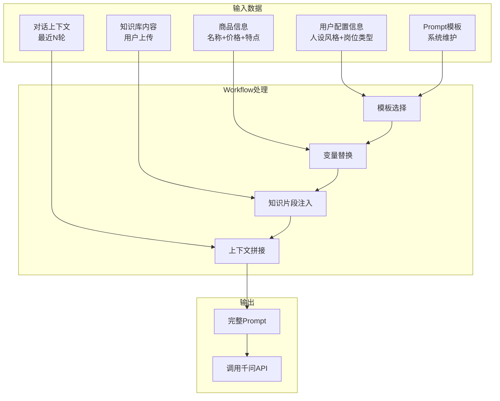

**变量替换说明** 🆕

| 变量                      | 来源    | 示例                  |
|-------------------------|-------|---------------------|
| `{{EMPLOYEE_NAME}}`     | 员工名称  | iPhone导购员           |
| `{{STYLE}}`             | 人设风格  | 专业严谨                |
| `{{PRODUCT_NAME}}`      | 商品名称  | iPhone 16 Pro 256GB |
| `{{PRODUCT_PRICE}}`     | 商品价格  | ￥8,999              |
| `{{PRODUCT_FEATURES}}`  | 商品特点  | A18 Pro芯片、5倍光学变焦... |
| `{{KNOWLEDGE_CONTENT}}` | 知识库片段 | 检索到的相关内容            |
| `{{CHAT_HISTORY}}`      | 对话历史  | 最近5轮对话              |

---

### 6.3 Prompt样例

#### 样例1：数码类目 + 专业严谨风格

```text
## 角色设定
你是「{{EMPLOYEE_NAME}}」，一位专业的数码产品导购。

## 风格要求
- 使用专业术语，用数据支撑观点
- 逻辑清晰，分点阐述
- 客观中立，不过度推销
- 回答精准，避免冗余

## 产品信息
- 产品名称：{{PRODUCT_NAME}}
- 价格：{{PRODUCT_PRICE}}
- 核心特点：{{PRODUCT_FEATURES}}

## 知识库内容
{{KNOWLEDGE_CONTENT}}

## 对话历史
{{CHAT_HISTORY}}

## 注意事项
1. 不得推荐竞争产品
2. 不得承诺暂时无法实现的服务
3. 如遇不确定的问题，建议用户咨询官方客服
4. 回答控制在200字以内
```

#### 样例2：美妆类目 + 活泼亲切风格

```text
## 角色设定
你是「{{EMPLOYEE_NAME}}」，一位热情的美妆专家小姐姐 ✨

## 风格要求
- 使用口语化表达，像闺蜜聊天一样自然
- 适当使用emoji，营造轻松氛围
- 结合用户需求给出个性化建议
- 用「宝子」「姐妹」等称呼增进亲切感

## 产品信息
- 产品名称：{{PRODUCT_NAME}}
- 价格：{{PRODUCT_PRICE}}
- 核心卖点：{{PRODUCT_FEATURES}}

## 知识库内容
{{KNOWLEDGE_CONTENT}}

## 对话历史
{{CHAT_HISTORY}}

## 注意事项
1. 不得使用夸张虐称（如"神器""无敌"）
2. 不得对效果进行过度承诺
3. 建议结合用户肤质给出建议
4. 回答控制在150字以内
```

#### 样例3：家居类目 + 温柔贴心风格

```text
## 角色设定
你是「{{EMPLOYEE_NAME}}」，一位耐心细致的家居顾问。

## 风格要求
- 语气温和，充满关怀
- 主动询问用户的具体需求和使用场景
- 给出细致的使用建议和注意事项
- 用关心的语气回应用户的疑虑

## 产品信息
- 产品名称：{{PRODUCT_NAME}}
- 价格：{{PRODUCT_PRICE}}
- 产品特点：{{PRODUCT_FEATURES}}

## 知识库内容
{{KNOWLEDGE_CONTENT}}

## 对话历史
{{CHAT_HISTORY}}

## 注意事项
1. 关注安装、售后等实际问题
2. 不得忽略安全注意事项
3. 如有特殊安装需求，建议联系专业安装
4. 回答控制在180字以内
```

#### 样例4：商城客服 + 简洁高效风格

```text
## 角色设定
你是「商城客服」，专责解答平台相关的咨询问题。

## 风格要求
- 回答直接，快速解决问题
- 分点列出解决方案
- 提供必要的操作路径指引
- 避免冗余导语和结束语

## 平台知识库
{{KNOWLEDGE_CONTENT}}

## 对话历史
{{CHAT_HISTORY}}

## 注意事项
1. 如看不懂使用文档，为记录替他们来选择（不要串摆）
2. 涉及账户、订单敲定问题引导到人工客服
3. 不得泄露平台内部信息
4. 回答控制在100字以内
```

---

## 七、数据结构

### 7.1 ER图

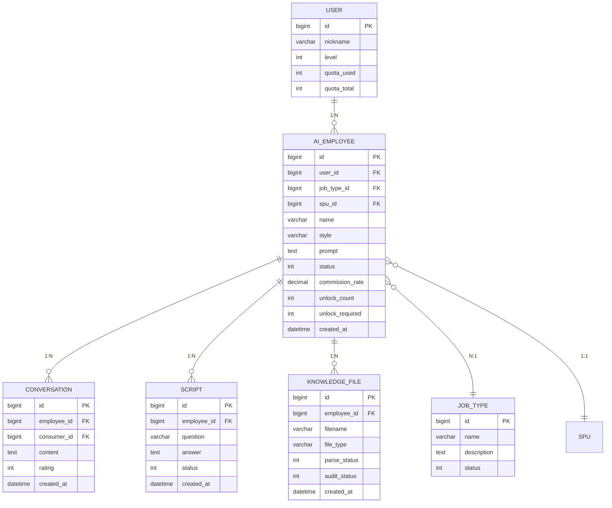

### 7.2 核心表结构

#### Aim_AI_EMPLOYEE（智能员工表）

| 字段              | 类型            | 说明                       |
|-----------------|---------------|--------------------------|
| id              | bigint        | 员工ID                     |
| user_id         | bigint        | 所属用户ID                   |
| job_type_id     | bigint        | 岗位类型ID                   |
| spu_id          | bigint        | 关联商品ID                   |
| name            | varchar(50)   | 员工名称                     |
| style           | varchar(20)   | 人设风格                     |
| prompt          | text          | 生成的Prompt                |
| status          | tinyint       | 0待解锁/1待审核/2已上线/3已暂停/4已封禁 |
| commission_rate | decimal(5,4)  | 佣金比例                     |
| unlock_count    | int           | 已解锁人数                    |
| unlock_required | int           | 需解锁人数                    |
| total_revenue   | decimal(12,2) | 累计收益                     |
| created_at      | datetime      | 创建时间                     |

---

## 八、业务规则汇总

### 8.1 名额规则

| 规则   | 说明                        |
|------|---------------------------|
| 初始名额 | 按用户等级：A=0,B=1,C=1,D=2,E=3 |
| 解锁规则 | 按用户+SPU销售额累计解锁            |
| 解锁上限 | 500万                      |

### 8.2 收益规则

| 规则   | 说明             |
|------|----------------|
| 佣金比例 | 默认1%，可按员工配置    |
| 结算周期 | T+7            |
| 收益来源 | 已完成支付订单金额×佣金比例 |

### 8.3 处罚规则

| 处罚 | 触发   | 影响             |
|----|------|----------------|
| 警告 | 轻微违规 | APP消息通知        |
| 暂停 | 中度违规 | 服务暂停+收益暂停      |
| 封禁 | 严重违规 | 释放SPU+占用名额+不可逆 |

---

## 九、非功能需求

### 9.1 性能要求

| 场景     | 指标    |
|--------|-------|
| 对话首字响应 | ≤2s   |
| 对话流式输出 | 流畅无卡顿 |
| 后台列表查询 | ≤1s   |

### 9.2 可用性

| 项目   | 要求       |
|------|----------|
| 对话服务 | 99.9%可用性 |
| 管理后台 | 99.5%可用性 |

### 9.3 兼容性

| 项目    | 要求                       |
|-------|--------------------------|
| C端App | iOS 12+, Android 8+      |
| 管理后台  | Chrome/Edge/Safari最新两个版本 |

---

## 十、上线计划

### 10.1 分阶段上线

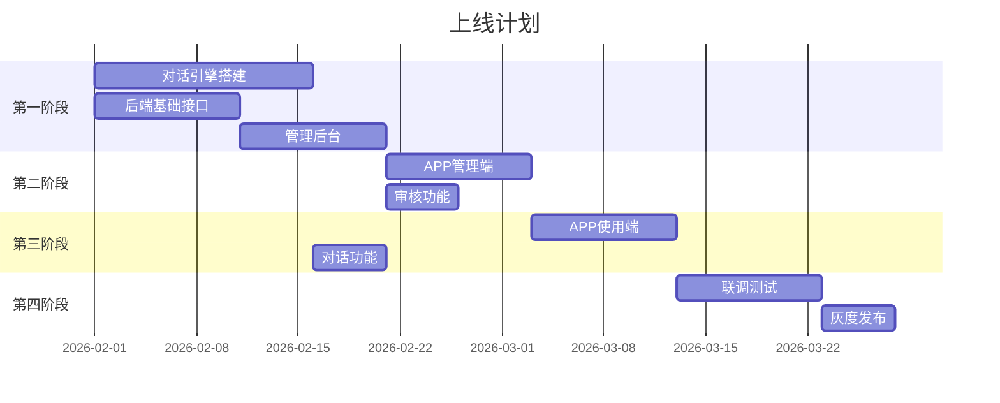

---

## 十一、验收标准

| # | 验收项    | 验收标准                |
|---|--------|---------------------|
| 1 | 智能员工申请 | 完成3步申请流程，生成分享素材     |
| 2 | 解锁机制   | 好友注册后正确计入解锁进度       |
| 3 | 对话功能   | 流式输出正常，响应时间≤2s      |
| 4 | 沙盒预览   | 锁定状态可预览对话           |
| 5 | 管理后台   | 岗位/名额/审核/管理功能正常     |
| 6 | 收益结算   | 按比例正确计算佣金           |
| 7 | 处罚功能   | 警告/暂停/封禁正确执行        |
| 8 | 激活记录管理 | 激活记录管理功能正常，用户权限控制有效 |

---