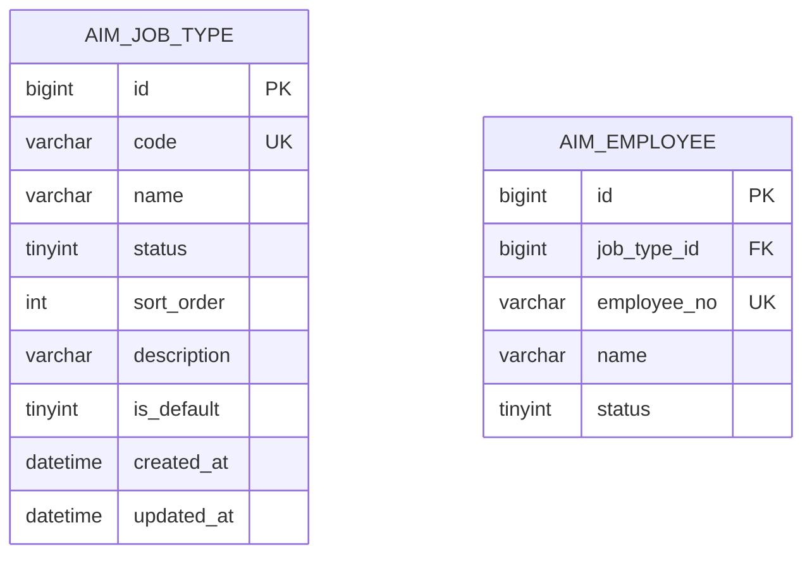
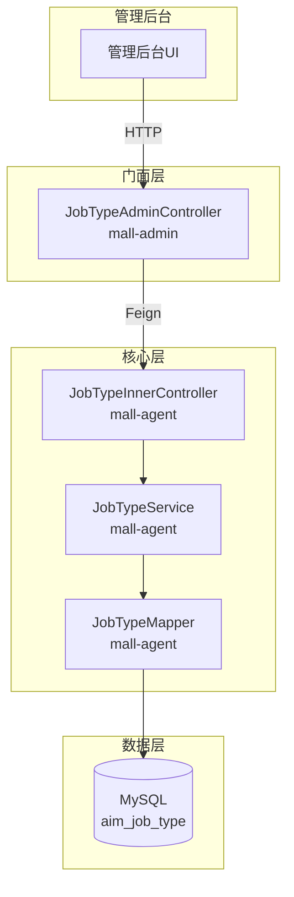
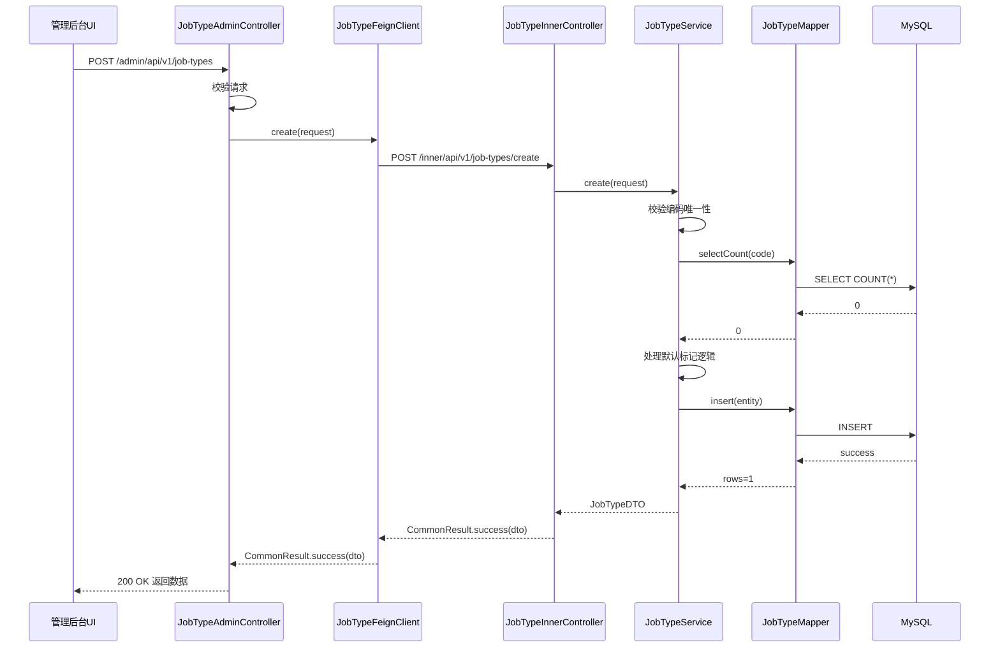
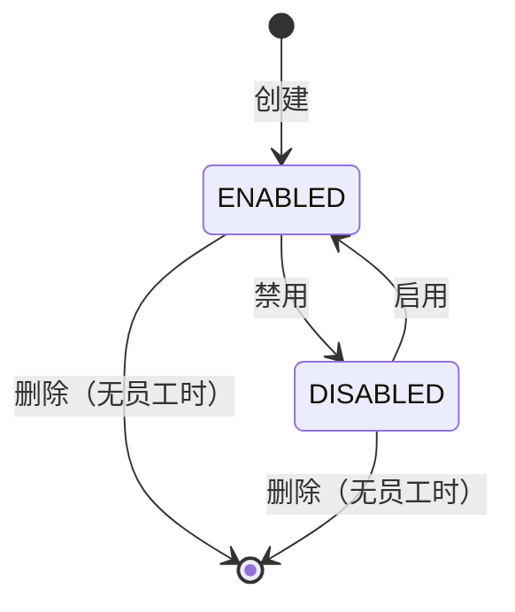

# 技术规格书 - REQ-018

## 1. 概述

### 1.1 目标

实现管理后台岗位类型管理接口组，为AI员工岗位类型提供增删改查和状态管理功能。

### 1.2 背景

根据PRD第5.2节和线框图A-002/A-003，管理后台需要支持岗位类型的全生命周期管理。岗位类型是创建AI员工时的必填选项，影响员工的业务定位和能力配置。

### 1.3 相关需求

| 需求ID | 描述 | 来源 |
|--------|------|------|
| REQ-018 | [mall-admin] 岗位管理接口组 | PRD 5.2, 线框图 A-002/A-003 |
| REQ-038 | [mall-agent] 岗位类型管理服务 | 核心服务实现 |

### 1.4 技术选型

| 层级 | 技术 | 原因 |
|------|------|------|
| Web层 | Spring Boot 3.x + Spring MVC | 标准REST API框架 |
| 数据访问 | MyBatis-Plus | 简化CRUD操作 |
| 数据库 | MySQL 8.x | 现有基础设施 |
| 服务通信 | OpenFeign | 跨服务调用 |
| 参数校验 | Jakarta Validation | 标准Bean校验 |

---

## 2. 数据模型设计

### 2.1 ER图



### 2.2 表结构

#### aim_job_type 表

**设计说明：**
- 用途：存储AI员工岗位类型定义
- 预估数据量：< 100条记录（配置表）
- 相关需求：REQ-018, REQ-038

**表结构：**

| 字段名 | 类型 | 约束 | 默认值 | 说明 |
|--------|------|------|--------|------|
| id | BIGINT | PK, AUTO_INCREMENT | - | 主键ID |
| code | VARCHAR(32) | NOT NULL, UNIQUE | - | 岗位编码（全局唯一） |
| name | VARCHAR(64) | NOT NULL | - | 显示名称 |
| status | TINYINT | NOT NULL | 1 | 状态：0-禁用，1-启用 |
| sort_order | INT | NOT NULL | 0 | 显示排序 |
| description | VARCHAR(255) | NULL | - | 描述文本 |
| is_default | TINYINT | NOT NULL | 0 | 默认标记：0-否，1-是 |
| created_at | DATETIME | NOT NULL | CURRENT_TIMESTAMP | 创建时间 |
| updated_at | DATETIME | NOT NULL | CURRENT_TIMESTAMP ON UPDATE | 更新时间 |

**索引设计：**

| 索引名 | 类型 | 字段 | 说明 |
|--------|------|------|------|
| PRIMARY | PRIMARY | id | 主键索引 |
| uk_code | UNIQUE | code | 编码唯一约束 |
| idx_status | NORMAL | status | 状态查询索引 |
| idx_sort_order | NORMAL | sort_order | 排序索引 |

**SQL DDL：**

```sql
CREATE TABLE aim_job_type (
    id BIGINT NOT NULL AUTO_INCREMENT COMMENT '主键ID',
    code VARCHAR(32) NOT NULL COMMENT '岗位编码（全局唯一）',
    name VARCHAR(64) NOT NULL COMMENT '显示名称',
    status TINYINT NOT NULL DEFAULT 1 COMMENT '状态：0-禁用，1-启用',
    sort_order INT NOT NULL DEFAULT 0 COMMENT '显示排序',
    description VARCHAR(255) NULL COMMENT '描述文本',
    is_default TINYINT NOT NULL DEFAULT 0 COMMENT '默认标记：0-否，1-是',
    created_at DATETIME NOT NULL DEFAULT CURRENT_TIMESTAMP COMMENT '创建时间',
    updated_at DATETIME NOT NULL DEFAULT CURRENT_TIMESTAMP ON UPDATE CURRENT_TIMESTAMP COMMENT '更新时间',
    PRIMARY KEY (id),
    UNIQUE KEY uk_code (code),
    KEY idx_status (status),
    KEY idx_sort_order (sort_order)
) ENGINE=InnoDB DEFAULT CHARSET=utf8mb4 COMMENT='岗位类型表';
```

### 2.3 表变更清单

| 操作 | 表名 | 说明 |
|------|------|------|
| 创建 | aim_job_type | 岗位管理新表 |

---

## 3. API接口定义

### 3.1 接口概览

| 服务 | HTTP方法 | 路径 | 说明 |
|------|----------|------|------|
| mall-admin | GET | /admin/api/v1/job-types | 岗位列表（分页） |
| mall-admin | POST | /admin/api/v1/job-types | 新增岗位 |
| mall-admin | PUT | /admin/api/v1/job-types/{jobTypeId} | 编辑岗位 |
| mall-admin | PUT | /admin/api/v1/job-types/{jobTypeId}/status | 启用/禁用岗位 |
| mall-admin | DELETE | /admin/api/v1/job-types/{jobTypeId} | 删除岗位 |
| mall-agent | GET | /inner/api/v1/job-types/list | 内部：列表查询 |
| mall-agent | POST | /inner/api/v1/job-types/create | 内部：新增 |
| mall-agent | PUT | /inner/api/v1/job-types/update | 内部：更新 |
| mall-agent | PUT | /inner/api/v1/job-types/status | 内部：状态变更 |
| mall-agent | DELETE | /inner/api/v1/job-types/delete | 内部：删除 |
| mall-agent | GET | /inner/api/v1/job-types/detail | 内部：详情查询 |

### 3.2 接口详情

#### 3.2.1 岗位列表查询（分页）

**基本信息：**
- 路径：`GET /admin/api/v1/job-types`
- 服务：mall-admin
- 调用方：管理后台
- 关联需求：REQ-018

**请求参数：**

| 字段 | 类型 | 必填 | 校验规则 | 说明 |
|------|------|------|----------|------|
| keyword | String | 否 | 最大100字符 | 名称和描述模糊搜索 |
| pageNum | Integer | 否 | 最小1，默认1 | 页码 |
| pageSize | Integer | 否 | 最小1，最大100，默认10 | 每页条数 |

**响应结果：**

```json
{
  "code": 200,
  "message": "success",
  "data": {
    "total": 100,
    "pages": 10,
    "current": 1,
    "size": 10,
    "records": [
      {
        "id": 1,
        "code": "SALES",
        "name": "商品销售",
        "status": 1,
        "sortOrder": 1,
        "description": "商品销售专员",
        "isDefault": 1,
        "employeeCount": 15,
        "createdAt": "2026-02-26 10:00:00",
        "updatedAt": "2026-02-26 10:00:00"
      }
    ]
  }
}
```

**响应字段：**

| 字段 | 类型 | 说明 |
|------|------|------|
| id | Long | 岗位ID |
| code | String | 岗位编码 |
| name | String | 显示名称 |
| status | Integer | 状态：0-禁用，1-启用 |
| sortOrder | Integer | 排序 |
| description | String | 描述 |
| isDefault | Integer | 默认标记：0-否，1-是 |
| employeeCount | Integer | 关联员工数量（计算字段） |
| createdAt | String | 创建时间 |
| updatedAt | String | 更新时间 |

**业务逻辑：**
1. 根据关键字构建查询条件（名称和描述模糊匹配）
2. 按sort_order升序、created_at降序排序
3. 分页查询aim_job_type表
4. 计算每个岗位类型的employee_count（查询aim_employee表）
5. 返回分页结果

**异常场景：**

| 异常 | 错误码 | 处理逻辑 |
|------|--------|----------|
| 分页参数非法 | 10091001 | 返回400，提示参数错误 |

---

#### 3.2.2 新增岗位

**基本信息：**
- 路径：`POST /admin/api/v1/job-types`
- 服务：mall-admin
- 调用方：管理后台
- 关联需求：REQ-018

**请求参数：**

| 字段 | 类型 | 必填 | 校验规则 | 说明 |
|------|------|------|----------|------|
| code | String | 是 | 长度1-32，字母数字下划线 | 岗位编码 |
| name | String | 是 | 长度1-64 | 显示名称 |
| sortOrder | Integer | 否 | 默认0 | 排序 |
| description | String | 否 | 最大255字符 | 描述 |
| isDefault | Integer | 否 | 0或1，默认0 | 默认标记 |

**请求示例：**

```json
{
  "code": "CONSULTANT",
  "name": "购物顾问",
  "sortOrder": 2,
  "description": "专业购物顾问",
  "isDefault": 0
}
```

**响应结果：**

```json
{
  "code": 200,
  "message": "success",
  "data": {
    "id": 2,
    "code": "CONSULTANT",
    "name": "购物顾问",
    "status": 1,
    "sortOrder": 2,
    "description": "专业购物顾问",
    "isDefault": 0,
    "createdAt": "2026-02-26 10:30:00",
    "updatedAt": "2026-02-26 10:30:00"
  }
}
```

**业务逻辑：**
1. 校验请求参数
2. 校验编码唯一性（全局）
3. 如果isDefault=1，清除其他岗位类型的默认标记
4. 插入aim_job_type表记录
5. 返回创建的岗位信息

**异常场景：**

| 异常 | 错误码 | 处理逻辑 |
|------|--------|----------|
| 编码已存在 | 10092002 | 返回400，提示编码已存在 |
| 编码格式非法 | 10091002 | 返回400，提示编码格式错误 |
| 名称不能为空 | 10091003 | 返回400，提示名称不能为空 |
| 参数非法 | 10091001 | 返回400，提示参数错误 |

---

#### 3.2.3 编辑岗位

**基本信息：**
- 路径：`PUT /admin/api/v1/job-types/{jobTypeId}`
- 服务：mall-admin
- 调用方：管理后台
- 关联需求：REQ-018

**路径参数：**

| 字段 | 类型 | 必填 | 说明 |
|------|------|------|------|
| jobTypeId | Long | 是 | 岗位ID |

**请求参数：**

| 字段 | 类型 | 必填 | 校验规则 | 说明 |
|------|------|------|----------|------|
| name | String | 是 | 长度1-64 | 显示名称 |
| sortOrder | Integer | 否 | 默认0 | 排序 |
| description | String | 否 | 最大255字符 | 描述 |
| isDefault | Integer | 否 | 0或1，默认0 | 默认标记 |

**请求示例：**

```json
{
  "name": "高级购物顾问",
  "sortOrder": 3,
  "description": "高级购物顾问",
  "isDefault": 1
}
```

**业务逻辑：**
1. 校验岗位类型是否存在
2. 校验请求参数
3. 如果isDefault=1，清除其他岗位类型的默认标记
4. 更新aim_job_type表记录（编码不可修改）
5. 返回更新后的岗位信息

**异常场景：**

| 异常 | 错误码 | 处理逻辑 |
|------|--------|----------|
| 岗位类型不存在 | 10092003 | 返回404，提示岗位类型不存在 |
| 参数非法 | 10091001 | 返回400，提示参数错误 |

---

#### 3.2.4 启用/禁用岗位

**基本信息：**
- 路径：`PUT /admin/api/v1/job-types/{jobTypeId}/status`
- 服务：mall-admin
- 调用方：管理后台
- 关联需求：REQ-018

**路径参数：**

| 字段 | 类型 | 必填 | 说明 |
|------|------|------|------|
| jobTypeId | Long | 是 | 岗位ID |

**请求参数：**

| 字段 | 类型 | 必填 | 校验规则 | 说明 |
|------|------|------|----------|------|
| status | Integer | 是 | 0或1 | 状态：0-禁用，1-启用 |

**请求示例：**

```json
{
  "status": 0
}
```

**业务逻辑：**
1. 校验岗位类型是否存在
2. 仅更新status字段
3. 不影响已存在的员工
4. 返回成功

**异常场景：**

| 异常 | 错误码 | 处理逻辑 |
|------|--------|----------|
| 岗位类型不存在 | 10092003 | 返回404 |
| 状态值非法 | 10091001 | 返回400 |

---

#### 3.2.5 删除岗位

**基本信息：**
- 路径：`DELETE /admin/api/v1/job-types/{jobTypeId}`
- 服务：mall-admin
- 调用方：管理后台
- 关联需求：REQ-018

**路径参数：**

| 字段 | 类型 | 必填 | 说明 |
|------|------|------|------|
| jobTypeId | Long | 是 | 岗位ID |

**业务逻辑：**
1. 校验岗位类型是否存在
2. 检查是否有员工绑定该岗位类型
3. 如果员工数量>0，拒绝删除
4. 从aim_job_type表删除记录
5. 返回成功

**异常场景：**

| 异常 | 错误码 | 处理逻辑 |
|------|--------|----------|
| 岗位类型不存在 | 10092003 | 返回404 |
| 存在绑定员工 | 10092004 | 返回400，提示存在绑定员工无法删除 |
| 默认岗位不可删除 | 10092005 | 返回400，提示默认岗位不可删除 |

---

### 3.3 Feign接口定义

#### JobTypeFeignClient (mall-admin)

```java
@FeignClient(name = "mall-agent", path = "/inner/api/v1/job-types")
public interface JobTypeFeignClient {
    
    @GetMapping("/list")
    CommonResult<PageResult<JobTypeDTO>> list(@RequestParam JobTypeListQuery query);
    
    @PostMapping("/create")
    CommonResult<JobTypeDTO> create(@RequestBody JobTypeCreateRequest request);
    
    @PutMapping("/update")
    CommonResult<JobTypeDTO> update(@RequestBody JobTypeUpdateRequest request);
    
    @PutMapping("/status")
    CommonResult<Void> updateStatus(@RequestBody JobTypeStatusRequest request);
    
    @DeleteMapping("/delete")
    CommonResult<Void> delete(@RequestParam Long jobTypeId);
    
    @GetMapping("/detail")
    CommonResult<JobTypeDTO> getById(@RequestParam Long jobTypeId);
}
```

---

### 3.4 错误码规范

> **参考文档**: `.qoder/repowiki/zh/docs/specs/错误码规范.md`

错误码采用 **8位数字字符串** 格式：`SSMMTNNN`

- **SS**: 系统标识 = `10` (电商主系统)
- **MM**: 模块标识 = `09` (智能员工模块)
- **T**: 错误类型
- **NNN**: 错误序号

#### 错误类型定义

| 类型值 | 类型名称 | 说明 |
|--------|----------|------|
| 1 | 参数错误 | 输入参数校验失败 |
| 2 | 业务错误 | 业务规则校验失败 |
| 3 | 远程调用错误 | Feign 调用失败 |
| 4 | 数据库错误 | 数据库操作异常 |
| 5 | 系统错误 | 系统内部错误 |

#### 岗位类型错误码列表

| 错误码 | 错误信息 | HTTP状态 | 使用场景 |
|--------|----------|----------|----------|
| 10091001 | 岗位类型参数错误 | 400 | 通用参数校验失败 |
| 10091002 | 岗位编码格式非法 | 400 | 编码不符合规范 |
| 10091003 | 岗位名称不能为空 | 400 | 名称为空或空白 |
| 10092001 | 岗位类型业务错误 | 400 | 通用业务错误 |
| 10092002 | 岗位编码已存在 | 400 | 新增/更新时编码重复 |
| 10092003 | 岗位类型不存在 | 404 | 查询/更新不存在的岗位 |
| 10092004 | 存在绑定员工无法删除 | 400 | 删除时有员工绑定 |
| 10092005 | 默认岗位类型不可删除 | 400 | 尝试删除默认岗位 |
| 10095001 | 岗位类型系统错误 | 500 | 系统内部异常 |

---

## 4. 架构设计

### 4.1 服务调用关系



### 4.2 时序图 - 新增岗位



### 4.3 代码结构

```
repos/
├── mall-admin/
│   └── src/main/java/com/aim/mall/admin/
│       ├── controller/
│       │   └── JobTypeAdminController.java
│       ├── feign/
│       │   └── JobTypeFeignClient.java
│       └── dto/
│           ├── JobTypeListRequest.java
│           ├── JobTypeCreateRequest.java
│           ├── JobTypeUpdateRequest.java
│           ├── JobTypeStatusRequest.java
│           └── JobTypeResponse.java
│
└── mall-agent/
    └── src/main/java/com/aim/mall/agent/
        ├── controller/inner/
        │   └── JobTypeInnerController.java
        ├── service/
        │   ├── JobTypeService.java
        │   └── impl/
        │       └── JobTypeServiceImpl.java
        ├── mapper/
        │   └── JobTypeMapper.java
        ├── entity/
        │   └── JobType.java
        └── dto/
            ├── JobTypeDTO.java
            ├── JobTypeListQuery.java
            ├── JobTypeCreateRequest.java
            ├── JobTypeUpdateRequest.java
            └── JobTypeStatusRequest.java
```

---

## 5. 业务规则实现

### 5.1 状态机

岗位类型状态为简单的二元状态：



**状态定义：**

| 状态 | 值 | 说明 |
|------|-----|------|
| 启用 | 1 | 岗位类型激活，可被新员工选择 |
| 禁用 | 0 | 岗位类型停用，不可被新员工选择 |

### 5.2 校验规则

#### 编码唯一性校验

**规则：** 岗位编码必须全局唯一

**实现：**
```java
// JobTypeServiceImpl中
private void validateCodeUnique(String code, Long excludeId) {
    LambdaQueryWrapper<JobType> wrapper = new LambdaQueryWrapper<>();
    wrapper.eq(JobType::getCode, code);
    if (excludeId != null) {
        wrapper.ne(JobType::getId, excludeId);
    }
    long count = jobTypeMapper.selectCount(wrapper);
    if (count > 0) {
        throw new BusinessException(ErrorCodeEnum.AGENT_BUSINESS_ERROR, "岗位编码已存在");
    }
}
```

#### 默认标记逻辑

**规则：** 只能有一个岗位类型为默认（is_default = 1）

**实现：**
```java
// JobTypeServiceImpl中
private void handleDefaultFlag(Long currentId) {
    // 清除其他默认标记
    LambdaUpdateWrapper<JobType> wrapper = new LambdaUpdateWrapper<>();
    wrapper.ne(currentId != null, JobType::getId, currentId);
    wrapper.eq(JobType::getIsDefault, 1);
    wrapper.set(JobType::getIsDefault, 0);
    jobTypeMapper.update(null, wrapper);
}
```

#### 删除校验

**规则：** 只有当没有员工绑定时才能删除岗位类型

**实现：**
```java
// JobTypeServiceImpl中
private void validateCanDelete(Long jobTypeId) {
    // 查询该岗位类型的员工数量
    long count = employeeMapper.selectCount(
        new LambdaQueryWrapper<Employee>()
            .eq(Employee::getJobTypeId, jobTypeId)
    );
    if (count > 0) {
        throw new BusinessException(ErrorCodeEnum.AGENT_BUSINESS_ERROR, 
            "存在绑定员工，无法删除");
    }
}
```

### 5.3 业务流程

#### 新增岗位流程

1. 校验请求参数（Jakarta Validation）
2. 校验编码唯一性（全局）
3. 如果isDefault=1，清除其他岗位类型的默认标记
4. 插入新记录
5. 返回创建的实体

#### 编辑岗位流程

1. 校验岗位类型是否存在
2. 校验请求参数
3. 如果isDefault=1，清除其他岗位类型的默认标记
4. 更新记录（编码不可修改）
5. 返回更新后的实体

#### 删除岗位流程

1. 校验岗位类型是否存在
2. 检查该岗位类型的员工数量
3. 如果数量>0，返回错误
4. 删除记录
5. 返回成功

---

## 6. 验收标准

| ID | 标准 | 验证方式 |
|----|------|----------|
| AC-001 | 列表接口支持名称和描述关键字搜索 | 单元测试 + 集成测试 |
| AC-002 | 列表接口返回分页结果和员工数量 | 单元测试 |
| AC-003 | 新增接口校验编码唯一性（全局） | 单元测试 |
| AC-004 | 新增接口正确处理默认标记逻辑 | 单元测试 |
| AC-005 | 编辑接口禁止修改编码 | 单元测试 |
| AC-006 | 编辑接口正确处理默认标记逻辑 | 单元测试 |
| AC-007 | 状态变更接口仅更新状态字段 | 单元测试 |
| AC-008 | 删除接口校验员工数量 | 单元测试 |
| AC-009 | 删除接口拒绝有员工绑定的删除 | 集成测试 |
| AC-010 | 所有接口返回正确的错误码和消息 | 集成测试 |

---

## 7. 附录

### 7.1 需求追溯矩阵

| 需求 | 设计章节 | 数据库表 | API接口 | 实现类 |
|------|----------|----------|---------|--------|
| REQ-018 | 3.2, 4.2 | aim_job_type | /admin/api/v1/job-types/* | JobTypeAdminController, JobTypeService |
| REQ-038 | 3.3, 4.2 | aim_job_type | /inner/api/v1/job-types/* | JobTypeInnerController, JobTypeService |

### 7.2 变更记录

| 日期 | 版本 | 作者 | 说明 |
|------|------|------|------|
| 2026-02-26 | 1.0 | AI Agent | 初始版本 |

### 7.3 相关文档

- PRD：`inputs/prd/ai-agent-platform-prd.md` 第5.2节
- 线框图：`inputs/prd/ai-agent-platform-wireframes.md` A-002/A-003
- 决策记录：`workspace/decisions.md`
- 确认结果：`workspace/answers.md`
